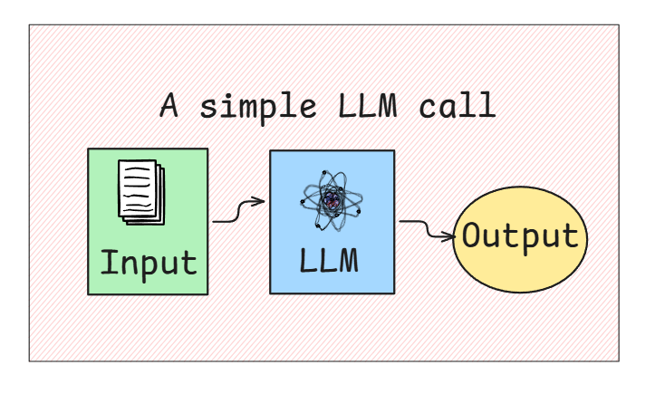
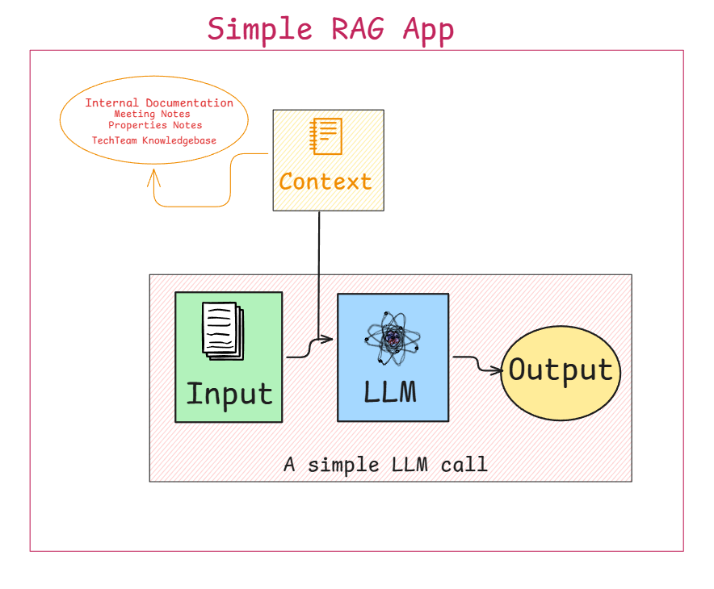
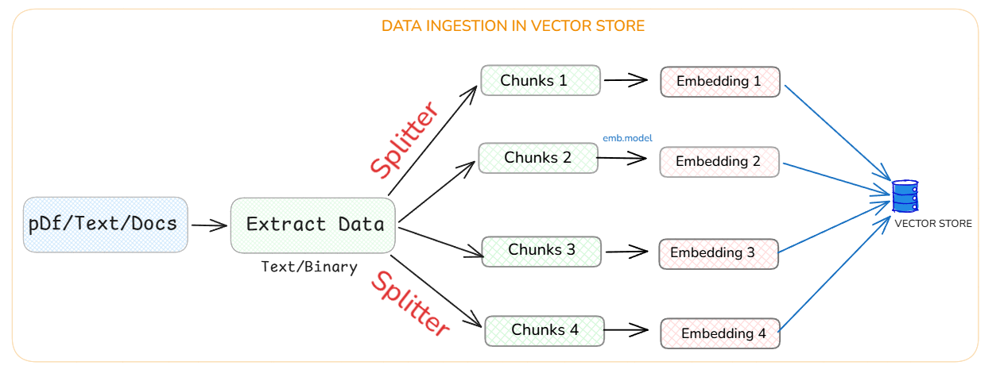
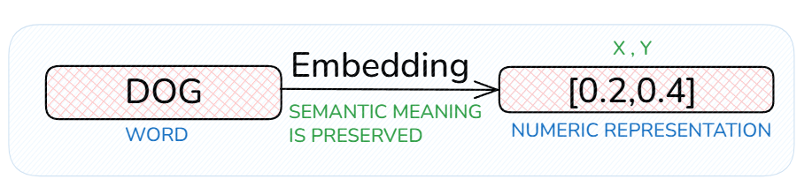
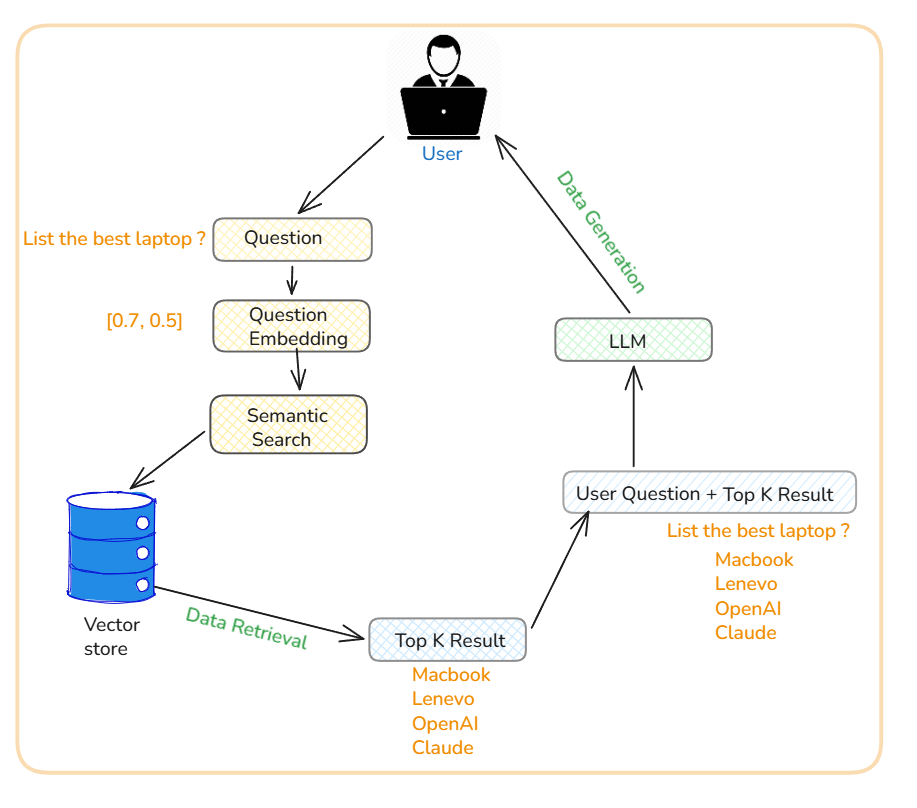

**RAG** stands for "**Retrieval-Augmented Generation**".  
RAG (Retrieval-Augmented Generation) is an AI approach where a language model first **retrieves relevant information from an external data source (like documents, databases, or the web)** and then uses that information to **generate a more accurate and up-to-date response**.
Instead of relying only on what the model already "knows," RAG makes it **look up information first, then answer**

### Why RAG is Important :

A simple LLM generates answers only from its `training data and the prompt`. RAG improves accuracy by retrieving relevant external information (documents, PDFs, databases, etc.) and providing it to the LLM before generating a response. This reduces hallucinations and enables the model to answer questions using up-to-date or private data.

### Why RAG is used:

- Improves accuracy of answers
- Reduces hallucinations (wrong information)
- Allows access to **latest or private data**
- Makes LLMs useful for custom knowledge bases (like company docs)

#### RAG Pipeline :

- Data Ingestion in Vector Store

1. Chunks = Split large documents into smaller pieces (chunks).
2. Embedding = Convert each chunk into a numerical vector using an embedding model. Similar text gets similar vectors.

3. Vector Store = Store embeddings in a vector database.

#### Overall pipeline and working

#### Pipeline Steps :

1. **User Query**
    
    The user asks something like "List the best laptop?".
    
2. **Question Embedding**
    
    The query is converted into a numerical vector representation.
    
3. **Semantic Search**
    
    That vector is compared with stored document vectors in the **vector store** to find similar content.
    
4. **Top-K Retrieval**
    
    The most relevant results are returned, such as "Macbook", "Lenovo", "OpenAI", and "Claude" in the diagram.
    
5. **LLM Generation**
    
    The LLM receives the original question plus the retrieved results and generates a response.