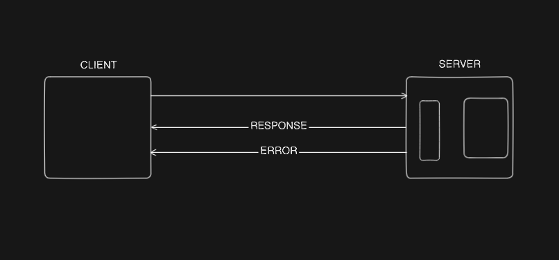
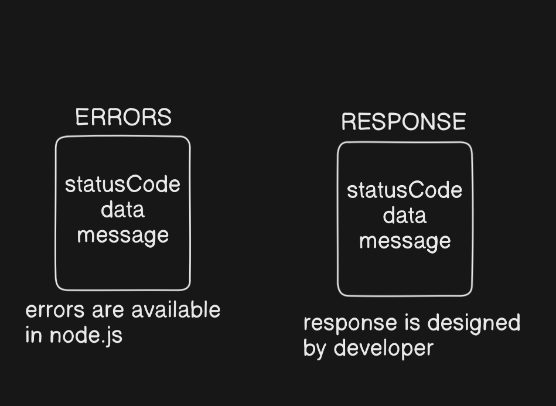

Express is the most popular Node.js web framework, and is the underlying library for a number of other popular Node.js frameworks.

## Is Express opinionated?

Web frameworks often refer to themselves as **opinionated** or **unopinionated**.

- **Opinionated** frameworks are those with opinions about the "right way" to handle any particular task. They often support rapid development *in a particular domain* (solving problems of a particular type) because the right way to do anything is usually well-understood and well-documented. However, they can be less flexible at solving problems outside their main domain, and tend to offer fewer choices for what components and approaches they can use.
- **Unopinionated** frameworks, by contrast, have far fewer restrictions on the best way to glue components together to achieve a goal, or even what components should be used. They make it easier for developers to use the most suitable tools to complete a particular task, albeit at the cost that you need to find those components yourself.

Express is **unopinionated**. You can insert almost any compatible middleware you like into the request handling chain, in almost any order you like. You can structure the app in one file or multiple files, and using any directory structure. You may sometimes feel that you have too many choices!

### Installation of Express JS

```bash
npm install express@latest
```

### Let's Understand by Code

```jsx
import dotenv from "dotenv";
import express from "express";
dotenv.config({
   path: "./.env"
});
const app = express();
const port = process.env.PORT || 3000;

app.get('/', (req, res) => { 
  res.send('Hello World!');
});
 
app.get('/instagram', (req, res) => { 
  res.send('This is Instagram Page');
});

app.listen(port, () => {
  console.log(`Example app listening on port http://localhost:${port}`);
});
```

---

## What is Happening Here?

- This code sets up **two routes** in an **Express.js** web server.
- In **Express**, the `app.get()` method defines a **route** that responds to an HTTP **GET** request.

---

## 1. `app.get(path, callback)`

- **`path`**: URL path for the route (e.g., `'/'` is the home page).
- **`callback`**: A function that runs whenever a request hits that path using a GET request.
    
  It has **two parameters**:
    
  - `req` (**request**): Contains information about the incoming HTTP request.
  - `res` (**response**): Used to send data back to the client (e.g., browser).

---

## 2. First Route (Root `/`)

```jsx
app.get('/', (req, res) => {
  res.send('Hello World!');
});
```

- **Path**: `'/'`: This is the root or home page.
- **When you go to**: `http://localhost:3000/` (or whatever port your server runs on).
- **Response**: `"Hello World!"`: This is the plain text that gets sent to your browser.

---

## 3. Second Route (`/instagram`)

```jsx
app.get('/instagram', (req, res) => {
  res.send('This is Instagram Page');
});
```

- **Path**: `'/instagram'`: A subpage.
- **When you go to**: `http://localhost:3000/instagram`
- **Response**: `"This is Instagram Page"`: Displays in the browser.

---

## 4. How It Works in Practice

When a web browser sends a **GET request**:

- If the path is `/`, it triggers the **first** route and sends `"Hello World!"`.
- If the path is `/instagram`, it triggers the **second** route and sends `"This is Instagram Page"`.
- If you request any other path (like `/about`), you’ll get a 404 error unless you define a route for it.

### Basic Configuration while using Express

Let's understand the app use cases:

```jsx
app.use(express.json({ limit: "16kb" }))
app.use(express.urlencoded({ extended: true, limit: "16kb" }))
app.use(express.static("public"))
```

- **`express.json({ limit: "16kb" })`**: Parse incoming **JSON request bodies**, but reject anything over **16KB**.
- **`express.urlencoded({ extended: true, limit: "16kb" })`**: Parse **form submissions** (`application/x-www-form-urlencoded`) with richer data structures allowed, also limited to **16KB**.
- **`express.static("public")`**: Serve **static files** from the `public` folder so that they can be accessed directly by URL.

### CORS

CORS, or Cross-Origin Resource Sharing, is a security mechanism used by web browsers to control how resources on a web server can be requested from another domain (origin) different from the one serving the web page. It allows servers to specify who can access their resources and which kinds of requests are permitted.

In short, **CORS is the security feature that controls and permits safe cross-domain requests between websites and servers.**

**Key Points about CORS:**

- It is based on HTTP headers that a server sends in response to requests made from a different origin.
- A browser enforces the same-origin policy by default, which restricts web pages from making requests to a different domain.
- CORS provides a way for servers to relax this restriction safely, allowing cross-domain data sharing when explicitly permitted.
- Browsers may perform a "preflight" HTTP OPTIONS request to ask the server which methods and headers are allowed before making the actual request.
- It's commonly used when the front end (e.g., JavaScript app) is hosted on a different domain than the backend API server.

**Example:**

- If a web page is loaded from `https://example.com` and tries to fetch data from `https://api.partner.com`, the browser will check if `https://api.partner.com` allows this by looking at CORS headers like `Access-Control-Allow-Origin`. If allowed, the request proceeds; otherwise, it’s blocked for security.

### Basic configuration for CORS

Let's understand with code:

```jsx
import cors from "cors";

app.use(cors({
  origin: process.env.CORS_ORIGIN?.split(",") || "http://localhost:5123",
  credentials: true,
  methods: ["GET", "POST", "DELETE", "PUT", "PATCH", "OPTIONS"],
  allowedHeaders: ["Authorization", "Content-Type"]
}))
```

```env
CORS_ORIGIN = *
# (https://example.com, https://another.com)
# in .env file we put our url
```

### Standard API Response and API Error



- So we see that there are two things that will happen. First is Server `RESPONSE` to Client and Second is Server `ERROR` to Client.
- There are several classes where we handle this:



So, to handle this, we can make separate files in the `utils` folder:

- `api-response.js`

```jsx
class ApiResponse { 
 constructor(data, message, statusCode = "Success") {  
       this.message = message;   
       this.statusCode = statusCode;    
       this.data = data;   
       this.success = statusCode < 400;  
  }
}
export { ApiResponse };
```

- `api-error.js`

```jsx
class ApiError extends Error {
  constructor(   
    statusCode,  
    message = "Something went wrong",    
    errors = [],    
    stack = ""
  ) {
    super(message)        
    this.statusCode = statusCode        
    this.message = message       
    this.errors = errors        
    this.success = false        
    this.data = null         
    if (stack) {
       this.stack = stack        
    } else {  
       Error.captureStackTrace(this, this.constructor)   
    } 
  }
}
```

### Keeping Data in Constants

```jsx
export const UserRolesEnum = { 
  ADMIN: "admin",  
  PROJECT_ADMIN: "project_admin",  
  MEMBER: "member"
}

export const AvailableUserRoles = Object.values(UserRolesEnum)

export const TaskStateEnum = {  
  TODO: "todo",  
  IN_PROGRESS: "in_progress",  
  DONE: "done"
}
export const AvailableTaskStates = Object.values(TaskStateEnum)
```

### Let's understand about controllers

- **Controllers** contain the business logic (healthCheck function), responding with a standardized API response.
- Create a file in `controller` like `healthcheck.controller.js`:

```jsx
import { ApiResponse } from "../utils/api-response.js";
import { asyncHandler } from "../utils/async-handler.js";

// Async handler wrapper ensures errors are correctly sent to Express's error middleware
const healthCheck = asyncHandler(async (req, res) => {
  res.status(200).json(
    new ApiResponse(200, { message: "Server is running" })
  );
});

export { healthCheck };
```

### Let's understand Routes

- Connects the HTTP route (`/health`) to your controller.
- Create a file `healthcheck.routes.js` in `routes` folder:

```jsx
import express from "express";
import { healthCheck } from "../controllers/healthController.js";

const router = express.Router();

router.get("/health", healthCheck);

export default router;
```

### All things will be imported in app.js file

```jsx
import express from "express";
import healthRoutes from "./routes/healthRoutes.js";

const app = express();

app.use("/", healthRoutes);

export default app;
```
