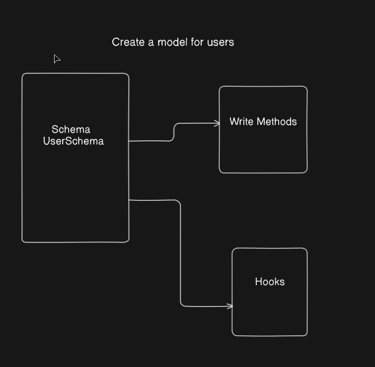

MongoDB is a popular, schema-less, document-oriented NoSQL database that stores data in flexible JSON-like documents.

## Mongoose ODM

**Mongoose** is an Object Data Modeling (ODM) library for MongoDB and Node.js. It provides a structured, schema-based solution for interacting with MongoDB collections.

Many Node.js developers choose Mongoose because it helps with:
- Data modeling and structure definition
- Schema enforcement
- In-depth validation (built-in and custom validators)
- Defining middleware hooks (pre/post save)
- Defining custom helper methods on documents

### Why Mongoose?
While MongoDB has a highly flexible data model that is easy to alter and update, many developers prefer or are accustomed to having structured schemas. Mongoose enforces a schema from the application level while retaining MongoDB's flexibility at the database level.

### Models
Models take your defined schema and apply it to each document inside its respective MongoDB collection. Models are responsible for all document operations like creating, reading, updating, and deleting (**CRUD**).

---

## Getting Started with Mongoose

### 1. Install Mongoose
Install the library in your Node.js project using `npm` or `pnpm`:

```bash
npm install mongoose
```

### 2. Establish Connection
Create a database connection utility (e.g. `src/db/database.js`):

```javascript
import mongoose from "mongoose";

const connectDB = async () => {
  try {
    await mongoose.connect(process.env.MONGO_URI);  
    console.log("MongoDB connected successfully");
  } catch (error) {  
    console.log("MongoDB connection failed:", error);  
    process.exit(1);
  }
};

export default connectDB;
```

---

## Creating a Schema & Model

Here is how to design a structured schema (such as a User schema) with validation, timestamps, middleware hooks, and helper methods.



### 1. User Schema Definition
Create a User Schema file (e.g. `src/models/user.model.js`):

```javascript
import mongoose, { Schema } from "mongoose";

const userSchema = new Schema(
  {
    avatar: {      
      type: {        
        url: String,        
        localPath: String,      
      },      
      default: {        
        url: `https://placehold.co/200x200`,       
        localPath: ""      
      }    
    },    
    username: {      
      type: String,      
      required: true,      
      unique: true,      
      lowercase: true,      
      trim: true,      
      index: true    
    },   
    email: {     
      type: String,      
      required: true,      
      unique: true,      
      lowercase: true,     
      trim: true,          
    },    
    fullName: {      
      type: String,      
      required: true,      
      trim: true,    
    },    
    password: {      
      type: String,      
      required: [true, "Password is required"],    
    },    
    isEmailVerified: {      
      type: Boolean,      
      default: false,    
    },    
    refreshToken: {      
      type: String,    
    },    
    forgotPasswordToken: {      
      type: String,    
    },    
    forgotPasswordTokenExpiry: {      
      type: Date,    
    },    
    emailVerificationToken: {      
      type: String,    
    },
    emailVerificationTokenExpiry: {      
      type: Date,    
    }  
  },  
  {    
    timestamps: true, 
  }
);
```

### 2. Encryption Middleware (Pre-Save Hook)
Use the `bcrypt` library to encrypt password fields before saving them to the database.

Install `bcrypt`:
```bash
npm install bcrypt
```

Add the `pre-save` hook to your schema:
```javascript
import bcrypt from "bcrypt";

// Hook to encrypt the password before saving a document
userSchema.pre("save", async function (next) {
  if (!this.isModified("password")) return next();   
  this.password = await bcrypt.hash(this.password, 10);   
  next();
});
```

### 3. Instance Methods
Add helpful custom methods to your schema instances (e.g. verifying a password):

```javascript
// Method to check if a password matches the stored hash
userSchema.methods.isPasswordCorrect = async function (password) {  
  return await bcrypt.compare(password, this.password);
};

// Export the compiled model
export const User = mongoose.model("User", userSchema);
```
