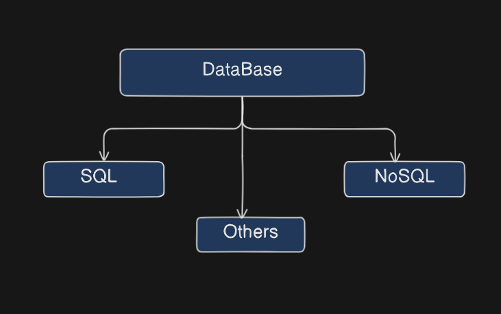
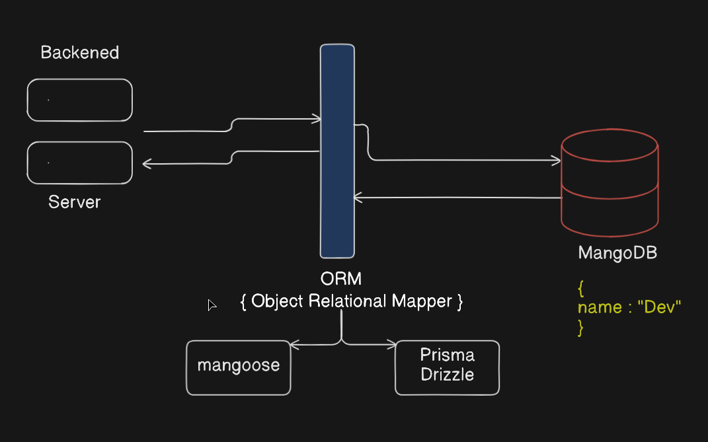

A database is a structured collection of data designed for efficient storage, retrieval, and manipulation. It serves as a centralized repository, allowing data to be accessed, managed, and updated by multiple users or applications.

### Without Database 👇

### With Database 👇

### Application of Database 👇

### Types of Database 👇

### Flow Diagram

### Components in a Database

---

### Database Technologies & Query Languages

Explore different database concepts and systems:

- [SQL (Structured Query Language)](/language/databases/sql)
- [NoSQL (Not Only SQL)](/language/databases/nosql)
- [MongoDB NoSQL Database](/language/databases/mongodb)
