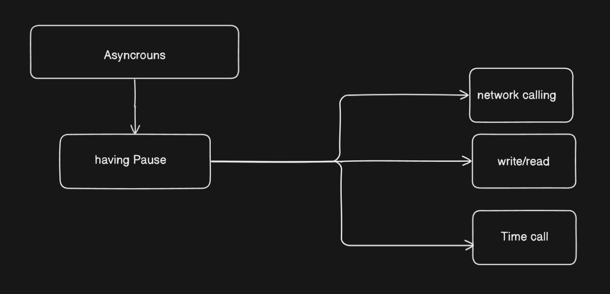
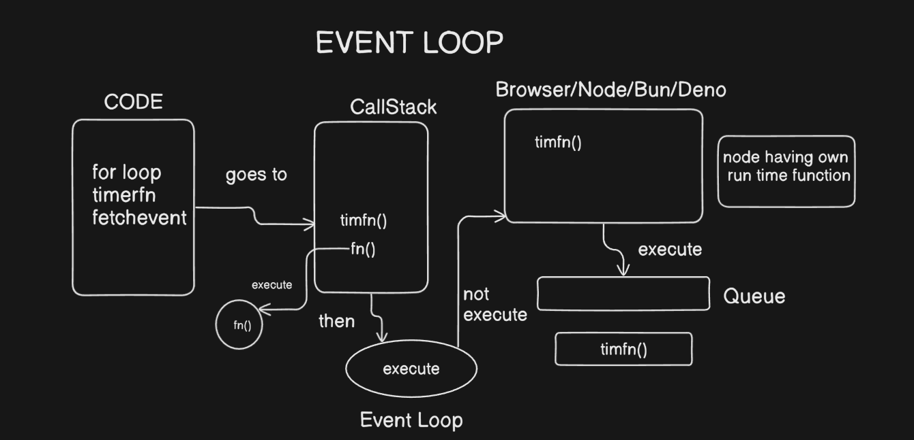

# Advance JS

## ASYNC FUNCTION

Asynchronous : Tasks can start and finish at different times, allowing your program to continue without waiting for tasks to complete.

```jsx
function fetchData() {
return new Promise((resolve) => {
setTimeout(() => { // It is define the time interval 
resolve("Data fetched!");
}, 2000);
});
}
```



**Why Use Asynchronous?**
•  It helps in performing long-running tasks like network requests or reading files without freezing the application.
Common Asynchronous Patterns :
•  Callbacks
•  Promises
•  Async/Await

### EVENT LOOP with Asynchronous JS →



The **event loop** is the **core mechanism** that makes **asynchronous JavaScript** (like `setTimeout`, `fetch`, `promises`) work — **without blocking the main thread**.

→ JavaScript is **single-threaded** — it can only do **one thing at a time**.

So, how does it handle tasks like:

- Delayed execution (`setTimeout`)
- HTTP requests (`fetch`)
- UI updates
- Promises / async-await

## Components You Must Know

### 1. **Call Stack**

- Where functions are executed.
- Follows **LIFO** (Last In, First Out).
- Only **one task** runs at a time.

### 2. **Web APIs / Browser APIs**

- Handle tasks like `setTimeout`, `DOM`, `fetch`, etc.
- Provided by the browser (not JavaScript itself).

### 3. **Callback Queue / Task Queue**

- Stores tasks ready to go back to the stack (like `setTimeout` callbacks).

### 4. **Microtask Queue**

- For **Promises**, `queueMicrotask()`, `MutationObserver`.
- Has **higher priority** than the callback queue.

---

## How the Event Loop Works (Step by Step)

1. JS code starts executing, functions go to the **call stack**.
2. If an async task (like `setTimeout`) is found:
    - It's sent to the **Web API**.
3. After the timer/API finishes, the callback is moved to the **callback queue**.
4. If the **call stack is empty**, the **event loop** moves the callback into the **call stack** for execution.
5. **Microtasks** (like `.then`) always run **before** any task from the callback queue.

```jsx
console.log('Start');

setTimeout(() => {
  console.log('Timeout');
}, 0);

Promise.resolve().then(() => {
  console.log('Promise');
});

console.log('End');
//output ->
Start
End
Promise
Timeout

```

### **Closure Function**

****A closure is created when a function is defined inside another function, and the inner function accesses variables from the outer function’s scope, even after the outer function has finished executing

```jsx
function outer() {
let counter = 4;
return function() {
counter++;
return counter;
};
}
let increment = outer();
console.log(increment()); // output = 5
console.log(increment()); // output = 6
console.log(increment()); // output = 7
```

### Promise ()

A Promise in JavaScript is an object that represents the eventual completion (or failure) of an asynchronous operation, and allows you to handle the result when it's ready.

Example :- A "promise" is a container for a future value — like ordering food. You place the order (start the async task), and the promise will eventually be:

- *fulfilled* (you get your food)
- *rejected* (order failed)
- *pending* (still being prepared)

```jsx
function fetchData() {
return new Promise((resolve, reject)=>{
setTimeout(()=> {
let sucess = true / false ; // depends upon you 
if(sucess) {
resolve ("Data is fetched sucessfully");
} else {
reject ("Error fetching data ");
}
},3000);
});
fetchData()
.then((data) => console.log(data)); 
.catch((error) => console.error(error));
```

### Explanation:

`fetchData` Function:

Returns a **Promise**.

Inside the promise, `setTimeout` simulates an **asynchronous delay** of `3 seconds (3000ms)`.

`resolve` vs `reject`:

If `success === true`, it calls `resolve(...)`, which means the **promise is fulfilled**.

If `success === false`, it calls `reject(...)`, which means the **promise is rejected**.

### Prototypal Inheritance

**Prototypal Inheritance** is a mechanism in JavaScript where one object can access the properties and methods of another object through a chain of prototypes.

```jsx
const parent = {
  greet() {
    console.log("Hello from parent");
  },
};

const child = Object.create(parent); // child inherits from parent
child.greet(); // Output: Hello from parent

```

- `child` does not have its own `greet` method.
- JS engine **looks up the prototype chain** and finds `greet` in `parent`.

### This Keyword and Binding

`this` refers to the **context** in which a function is executed. It points to the object that is "calling" the function.

```jsx
const user = {
  name: "Dev",
  greet() {
    console.log("Hi, " + this.name);
  },
};

user.greet(); // "Hi, Dev"

```

But , we have to blind it .So, there is some method which is given below :-

```jsx
function greet() {
  console.log("Hello, " + this.name);
}

const person = { name: "Hari" };

greet.call(person);  // Hello, Hari
greet.apply(person); // Hello, Hari
const greetHari = greet.bind(person);
greetHari();         // Hello, Hari

```

### **`call()`**

> Calls a function immediately, with a specified this and arguments passed individually.
> 

### Syntax:

```jsx

func.call(thisArg, arg1, arg2, ..)
```

```jsx

function greet(greeting, emoji) {
  console.log(`${greeting}, I am ${this.name} ${emoji}`);
}

const person = { name: "Dev" };
greet.call(person, "Hello", "👋");
// Output: Hello, I am Dev 👋

```

---

### 2. **`apply()`**

> Similar to call(), but arguments are passed as an array.
> 

### Syntax:

```jsx

func.apply(thisArg, [arg1, arg2, ...])

```

### Example:

```jsx

greet.apply(person, ["Hi", "😊"]);
// Output: Hi, I am Dev 😊

```

Use `apply()` when you already have arguments in an array format (e.g., from `arguments` or `spread` situations).

---

### 3. **`bind()`**

> Returns a new function with the specified this, but does NOT execute it immediately.
> 

### Syntax:

```jsx
const boundFunc = func.bind(thisArg, arg1, arg2, ...);
boundFunc(); // you call it later

```

### Example:

```jsx
const sayHi = greet.bind(person, "Hey", "🤝");
sayHi();
// Output: Hey, I am Dev 🤝

```

### Async -Await ()

- **`async`**: Declares a function that always returns a **Promise**. An **`async`** function is declared with the **`async`** keyword before the **`function`** keyword. It always returns a Promise.

```jsx
async function myFunction() {
  return "Hello";
}

// Equivalent to:
function myFunction() {
  return Promise.resolve("Hello");
}
```

- **`await`**: Pauses the execution of an `async` function until the **Promise is resolved or rejected**. The **`await`** operator can only be used inside an **`async`** function. It pauses the execution of the async function and waits for the Promise to resolve or reject.

```jsx
async function fetchData() {
  const response = await fetch('https://api.example.com/data');
  const data = await response.json();
  return data;
}
```

```jsx
// Traditional Promise
function fetchDataWithPromise() {
  return fetch('https://api.example.com/data')
    .then(response => response.json())
    .then(data => {
      console.log(data);
      return data;
    })
    .catch(error => {
      console.error('Error:', error);
      throw error;
    });
}

// Same functionality with async/await
async function fetchDataWithAsync() {
  try {
    const response = await fetch('https://api.example.com/data');
    const data = await response.json();
    console.log(data);
    return data;
  } catch (error) {
    console.error('Error:', error);
    throw error;
  }
}
```

The **`try...catch`** statement is an error handling mechanism that allows you to "try" executing a block of code and "catch" any errors that might occur.

```jsx
try {
  // Code that might throw an error
} catch (error) {
  // Code to handle the error
}
```

### Iterators and Generators in JS

## **Generators in JavaScript**

A **generator** is a special type of function that can pause and resume execution. it is executive one by one .

### **Iterators**

An **iterator** is an object that provides a `.next()` method, which returns

```jsx
function* generatorFunction() { // * is used to define generator function 
  yield 1;
  yield 2;
  yield 3;
}
const gen = generatorFunction();

console.log(gen.next().value); // { value: 1}
console.log(gen.next().value); // { value: 2}
console.log(gen.next().value); // { value: 3}
console.log(gen.next().value); // { value: undefined}

```

### ES6 Modules and Common JS

## **What are Modules?**

Modules allow you to split your code into reusable, self-contained files. JavaScript supports two major module systems.

| Module Type | Used In |
| --- | --- |
| **Common JS (CJS)** | Node.js (default before ES6) |
| **ES6 Modules (ESM)** | Modern JavaScript (browsers + Node.js ≥ 12 with `"type": "module"`) |

## What is `export`?

`export` is used to **make variables, functions, or classes available** to other modules.

There are **two main ways to export**:

### 1. **Named Export**

Exports multiple things from a file. Each must be imported with the same name.

```jsx
// math.js
export function add(a, b) {
  return a + b;
}

export const PI = 3.14;

```

### 2. **Default Export**

Exports a single value from a file (function, object, class, etc.)

```jsx

// greet.js
export default function greet(name) {
  return `Hello, ${name}`;
}

```

---

## What is `import`?

`import` is used to **bring in variables, functions, or classes** that were exported from another module.

### 1. **Import Named Exports**

```jsx

// app.js
import { add, PI } from './math.js';

console.log(add(2, 3)); // 5
console.log(PI);        // 3.14

```

### 2. **Import Default Export**

```jsx

// app.js
import greet from './greet.js';

console.log(greet('Dev')); // Hello, Dev

```

### 3. **Import Everything**

```jsx

// app.js
import * as math from './math.js';

console.log(math.add(2, 3)); // 5
console.log(math.PI);        // 3.14

```

---

## Summary Table

| Feature | Syntax | Example |
| --- | --- | --- |
| Named export | `export { name }` or `export function` | `export const PI = 3.14` |
| Default export | `export default ...` | `export default function greet()` |
| Named import | `import { name }` | `import { add } from './file.js'` |
| Default import | `import name` | `import greet from './file.js'` |
| Import all | `import * as name` | `import * as math from './file.js'` |

### CommonJS (CJS) in JavaScript

**CommonJS** is the **module system used in Node.js** before ES6 modules (`import/export`) were introduced. It uses `require()` and `module.exports` for importing and exporting.

---

## Syntax of Common JS

### 1. **Exporting in Common JS**

You use `module.exports` or `exports` to export functions, variables, or objects.

```jsx

// math.js
function add(a, b) {
  return a + b;
}

module.exports = add;

```

OR for multiple exports:

```jsx

// math.js
function add(a, b) {
  return a + b;
}

function subtract(a, b) {
  return a - b;
}

module.exports = { add, subtract };

```

---

### 2. **Importing in CommonJS**

You use `require()` to import modules.

```jsx

// app.js
const add = require('./math');
console.log(add(5, 2)); // 7

```

If you exported an object:

```jsx

// app.js
const math = require('./math');
console.log(math.add(5, 2));      // 7
console.log(math.subtract(5, 2)); // 3

```

---

## Features of CommonJS

| Feature | Details |
| --- | --- |
| Default in Node.js | No config needed |
| Synchronous | Loaded at runtime, blocking |
| No Tree Shaking | Everything is included |
| Can't use in browser directly | Needs bundler like Webpack |

---

## Example: CommonJS Module Structure

**math.js**

```jsx

const square = (n) => n * n;
const cube = (n) => n * n * n;

module.exports = { square, cube };

```

**app.js**

```jsx

const math = require('./math');

console.log(math.square(3)); // 9
console.log(math.cube(2));   // 8

```

---

## CommonJS vs ES6 Modules

| Feature | CommonJS | ES6 Modules |
| --- | --- | --- |
| Export | `module.exports` | `export` / `export default` |
| Import | `require()` | `import` |
| Loading | Synchronous | Asynchronous |
| Environment | Node.js | Node.js + Browsers |
| Tree-shaking | No | Yes |