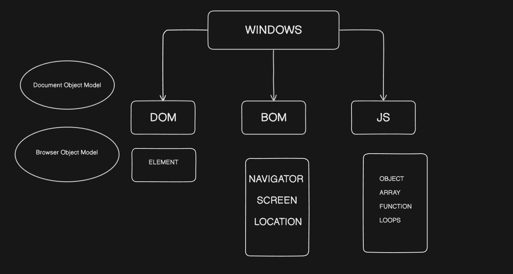
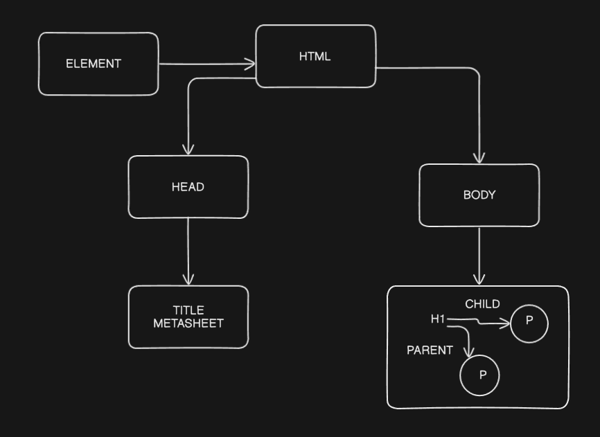
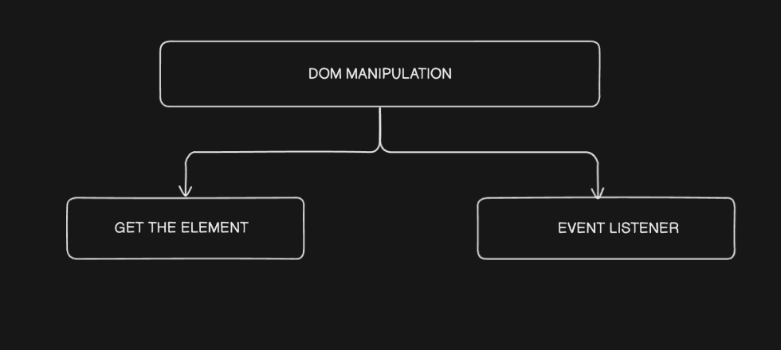

# DOM, BOM

LETS UNDERSTAND WITH FIGURE  →



## DOM  { DOCUMENT OBJECT MODEL }



```jsx
console.log(document); // used in browser to get all the properties of it
```

**DOM IS NOT EQUAL TO HTML**

**DOM = PROCESSED ELEMENT IN DOCUMENT TREE IN MEMORY**

**HTML = MARKUP LANGUAGE** 

## DOM MANIPULATION→

