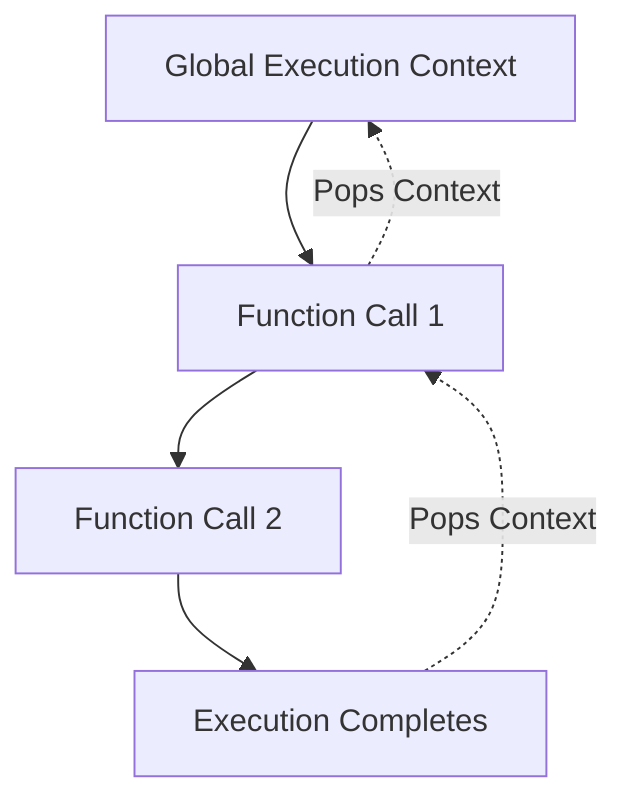
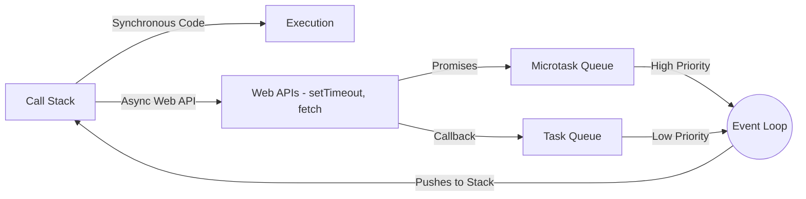

# JavaScript Interview Questions

A complete guide to JavaScript interview questions, categorized from basics to advanced concepts. Reference taken from [MDN Web Docs](https://developer.mozilla.org/en-US/docs/Web/JavaScript).

---

## Basics

### var vs let vs const

In JavaScript, there are three ways to declare variables.

| Feature | `var` | `let` | `const` |
| :--- | :--- | :--- | :--- |
| **Scope** | Function / Global | Block | Block |
| **Redeclaration** | Yes | No | No |
| **Reassignment** | Yes | Yes | No |
| **Hoisting** | Yes (initialized as `undefined`) | Yes (Temporal Dead Zone) | Yes (Temporal Dead Zone) |

### Primitive vs Non-Primitive Data Types

- **Primitive Types**: Immutable values that are not objects.
  - `String`, `Number`, `BigInt`, `Boolean`, `Undefined`, `Null`, `Symbol`.
  - Passed by **value**.
- **Non-Primitive Types**: Objects.
  - `Object`, `Array`, `Function`, `Date`, etc.
  - Passed by **reference**.

### Type Coercion

Type coercion is the automatic or implicit conversion of values from one data type to another (such as strings to numbers).
- **Implicit Coercion**: `1 + "2"` results in `"12"` (String concatenation).
- **Explicit Coercion**: `Number("2")` results in `2`.

### == vs ===

- `==` (Loose Equality): Compares two values for equality after performing type coercion. Example: `1 == "1"` is `true`.
- `===` (Strict Equality): Compares two values for equality without type coercion. Both value and type must be the same. Example: `1 === "1"` is `false`.

### Truthy & Falsy Values

A falsy value is a value that is considered false when encountered in a boolean context.
- **Falsy values**: `false`, `0`, `-0`, `0n`, `""`, `null`, `undefined`, and `NaN`.
- **Truthy values**: Everything else, including empty arrays `[]` and empty objects `{}`.

### Scope

Scope determines the accessibility (visibility) of variables.
1. **Global Scope**: Variables declared outside any function or block.
2. **Function Scope**: Variables declared inside a function (using `var`, `let`, `const`).
3. **Block Scope**: Variables declared inside a `{ }` block using `let` or `const`.

---

## Functions

### Function Declaration vs Expression

- **Function Declaration**: Defined using the `function` keyword and is hoisted to the top of its scope.
  ```js
  function greet() { return "Hello"; }
  ```
- **Function Expression**: Assigned to a variable. Not hoisted.
  ```js
  const greet = function() { return "Hello"; };
  ```

### Arrow Functions

Introduced in ES6, they provide a shorter syntax and lexically bind the `this` value (they don't have their own `this`).
```js
const add = (a, b) => a + b;
```

### Higher Order Functions

A function that takes another function as an argument or returns a function. Example: `map`, `filter`, `reduce`.

### Callback Functions

A callback is a function passed into another function as an argument, which is then invoked inside the outer function to complete some kind of routine or action.

### First Class Functions

In JavaScript, functions are treated as first-class citizens. This means functions can be assigned to variables, passed as arguments to other functions, and returned from functions.

---

## Advanced Concepts

### Closures

A closure is the combination of a function bundled together (enclosed) with references to its surrounding state (the lexical environment). A closure gives you access to an outer function's scope from an inner function.

### Lexical Environment

It consists of the local memory along with the lexical environment of its parent. It resolves where variables live and how they are accessed based on where they are written in the source code.

### Hoisting

Hoisting is JavaScript's default behavior of moving declarations to the top of the current scope.
- `var` declarations are hoisted and initialized with `undefined`.
- `let` and `const` are hoisted but not initialized (they remain in the Temporal Dead Zone).

### Temporal Dead Zone (TDZ)

The period from the start of the block until the declaration is evaluated. Accessing the variable in this zone throws a `ReferenceError`.

### Call Stack & Execution Context

- **Execution Context**: The environment in which JavaScript code is evaluated and executed. Contains the Variable Environment, Lexical Environment, and `this` binding.
- **Call Stack**: A LIFO (Last In, First Out) stack used to store all the execution contexts created during code execution.



### Event Loop

The Event Loop is a mechanism that allows JavaScript to perform non-blocking operations by offloading operations to the system kernel whenever possible.



### Microtasks vs Macrotasks

- **Microtasks**: Have higher priority. Includes Promises (`then`, `catch`, `finally`), `queueMicrotask`, `MutationObserver`.
- **Macrotasks (Task Queue)**: Have lower priority. Includes `setTimeout`, `setInterval`, `setImmediate`, DOM events.

---

## Asynchronous JavaScript

### Promises

A Promise represents the eventual completion (or failure) of an asynchronous operation and its resulting value. It has 3 states: `Pending`, `Fulfilled`, `Rejected`.

### Promise Chaining

Executing a sequence of asynchronous tasks where the result of one task is passed to the next using `.then()`.

### Promise Methods

- **Promise.all()**: Waits for all promises to be resolved or for any to be rejected. Returns an array of results.
- **Promise.allSettled()**: Waits until all promises have settled (each may resolve or reject). Returns an array of objects describing the outcome of each.
- **Promise.race()**: Waits until any of the promises is resolved or rejected and returns its result/error.

### Async/Await

Syntactic sugar built on top of Promises. Allows asynchronous code to be written in a synchronous-looking manner.
```js
async function fetchData() {
  try {
    const response = await fetch("api/data");
    const data = await response.json();
    return data;
  } catch (error) {
    console.error("Error", error);
  }
}
```

### Error Handling

Proper error handling in async JS is usually done using `.catch()` with Promises, or `try...catch` blocks within `async/await` functions.

---

## Browser Concepts

### Local Storage vs Session Storage vs Cookies

| Storage | Capacity | Expiration | Access |
| :--- | :--- | :--- | :--- |
| **Local Storage** | ~5MB-10MB | Never (manual clear) | Client-side only |
| **Session Storage** | ~5MB | On tab close | Client-side only |
| **Cookies** | ~4KB | Set by expiration time | Client and Server (sent with requests) |

### Debouncing

A technique to limit the rate at which a function gets invoked. It ensures that a function is not called again until a certain amount of time has passed since the last call. (Useful for search inputs).

### Throttling

A technique to limit the execution of a function to once in every specified time interval. (Useful for scrolling or window resizing events).

---

## Frequently Asked Questions

### 1. Explain Closures with examples.

A closure gives an inner function access to an outer function's variables, even after the outer function has returned.

```javascript
function makeCounter() {
  let count = 0; // 'count' is enclosed by the inner function
  return function() {
    count++;
    return count;
  };
}

const counter = makeCounter();
console.log(counter()); // 1
console.log(counter()); // 2
```

### 2. How does Event Loop work?

The Event Loop constantly monitors the **Call Stack** and the **Queues** (Microtask and Macrotask queues). If the Call Stack is empty, it first checks the Microtask queue. If there are pending microtasks (like Promise callbacks), it pushes them to the stack one by one. Once the Microtask queue is empty, it pushes the next macrotask (like `setTimeout` callbacks) to the stack.

### 3. Difference between var, let and const?

- `var` is function-scoped and allows redeclaration. It is hoisted and initialized with `undefined`.
- `let` is block-scoped, doesn't allow redeclaration in the same scope, and is hoisted into the Temporal Dead Zone (cannot be accessed before declaration).
- `const` is exactly like `let` but it cannot be reassigned.

### 4. Explain Promise and Async/Await.

- **Promise**: An object representing the eventual success or failure of an async operation. It resolves callback hell but can lead to long `.then()` chains.
- **Async/Await**: Syntactic sugar for Promises introduced in ES8. It allows writing async, promise-based code as if it were synchronous, making code much more readable and easier to debug.

### 5. What is Hoisting?

Hoisting is a JavaScript mechanism where variable and function declarations are moved to the top of their scope before code execution.
- Function declarations are fully hoisted.
- `var` variables are hoisted and set to `undefined`.
- `let` and `const` are hoisted but uninitialized (Temporal Dead Zone).

### 6. What is Debouncing?

Debouncing enforces that a function will not be called again until a certain amount of time has passed without it being called. For example, if you have a search bar, you don't want to make an API call for every keystroke. You debounce the API call to only trigger 300ms after the user stops typing.

```javascript
function debounce(func, delay) {
  let timeoutId;
  return function(...args) {
    clearTimeout(timeoutId);
    timeoutId = setTimeout(() => {
      func.apply(this, args);
    }, delay);
  };
}
```