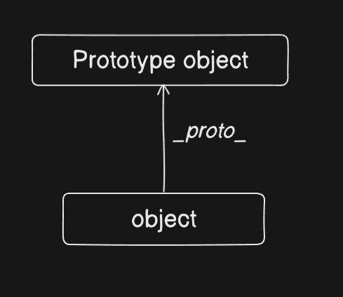

# OOPs Concept

### Prototypes in JS

The **`prototype`** data property of a [`Function`](https://developer.mozilla.org/en-US/docs/Web/JavaScript/Reference/Global_Objects/Function) instance is used when the function is used as a constructor with the [`new`](https://developer.mozilla.org/en-US/docs/Web/JavaScript/Reference/Operators/new) operator. It will become the new object's prototype.

JavaScript object having special properties called  PROTOTYPE that is either null and reference to another object ……..

```jsx
let genericCar= {tyre:4}

let tesla={
 driven : "AI"
}
Object.setPrototypeOf(tesla ,  genericCar);
console.log(`tesla` ,tesla.tyre);
console.log(`tesla` ,Object.getPrototypeOf(tesla));
```

```jsx
tesla 4
tesla { tyre: 4 }

```

Explanation:

- It creates an object genericCar with a property tyre set to 4.
- It creates another object tesla with a property driven set to "AI" and sets its prototype (**proto**) to genericCar. This means tesla inherits properties from genericCar.
- console.log(tesla, tesla.tyre); prints the value of tesla.tyre. Since tesla doesn't have its own tyre property, it looks up the prototype chain and finds tyre in genericCar, so it prints 4.
- console.log(tesla, Object.getPrototypeOf(tesla)); prints the prototype of tesla, which is the genericCar object.



When a function is called with [`new`](https://developer.mozilla.org/en-US/docs/Web/JavaScript/Reference/Operators/new), the constructor's `prototype` property will become the resulting object's prototype.


## Object-Oriented Programming (OOP) in JavaScript

OOP is a programming paradigm based on the concept of "objects" that contain data (properties) and code (methods). JavaScript supports OOP through prototypes and classes.

### Four Pillars of OOP

**1. Encapsulation** - Bundling data and methods that operate on that data within a single unit (object)

**2. Abstraction** - Hiding complex implementation details and showing only necessary features

**3. Inheritance** - Creating new classes from existing classes, inheriting their properties and methods

**4. Polymorphism** - Objects of different types can be accessed through the same interface

## Constructor Functions

Before ES6 classes, constructor functions were used to create objects.

```jsx
// Constructor function
function Person(name, age) {
  [this.name](http://this.name) = name;
  this.age = age;
  
  this.greet = function() {
    console.log(`Hello, I'm ${[this.name](http://this.name)}`);
  };
}

// Creating instances
const person1 = new Person("John", 30);
const person2 = new Person("Alice", 25);

person1.greet(); // Hello, I'm John
person2.greet(); // Hello, I'm Alice

console.log(person1 instanceof Person); // true
```

### Adding Methods to Prototype

```jsx
function Car(brand, model) {
  this.brand = brand;
  this.model = model;
}

// Add method to prototype (more memory efficient)
Car.prototype.getDetails = function() {
  return `${this.brand} ${this.model}`;
};

Car.prototype.start = function() {
  console.log(`${this.brand} ${this.model} is starting...`);
};

const car1 = new Car("Toyota", "Camry");
const car2 = new Car("Honda", "Civic");

car1.start(); // Toyota Camry is starting...
console.log(car2.getDetails()); // Honda Civic
```

## ES6 Classes

Classes are syntactic sugar over constructor functions and prototypes.

### Basic Class Syntax

```jsx
class Animal {
  constructor(name, species) {
    [this.name](http://this.name) = name;
    this.species = species;
  }
  
  // Method
  makeSound() {
    console.log(`${[this.name](http://this.name)} makes a sound`);
  }
  
  getInfo() {
    return `${[this.name](http://this.name)} is a ${this.species}`;
  }
}

// Creating instances
const dog = new Animal("Buddy", "Dog");
const cat = new Animal("Whiskers", "Cat");

dog.makeSound(); // Buddy makes a sound
console.log(cat.getInfo()); // Whiskers is a Cat
```

### Class with Constructor

```jsx
class Rectangle {
  constructor(width, height) {
    this.width = width;
    this.height = height;
  }
  
  getArea() {
    return this.width * this.height;
  }
  
  getPerimeter() {
    return 2 * (this.width + this.height);
  }
  
  isSquare() {
    return this.width === this.height;
  }
}

const rect = new Rectangle(10, 5);
console.log(rect.getArea()); // 50
console.log(rect.getPerimeter()); // 30
console.log(rect.isSquare()); // false

const square = new Rectangle(5, 5);
console.log(square.isSquare()); // true
```

## Inheritance

Inheritance allows a class to inherit properties and methods from another class.

### Using extends and super

```jsx
// Parent class
class Vehicle {
  constructor(brand, year) {
    this.brand = brand;
    this.year = year;
  }
  
  getInfo() {
    return `${this.brand} (${this.year})`;
  }
  
  start() {
    console.log(`${this.brand} is starting...`);
  }
}

// Child class inheriting from Vehicle
class Car extends Vehicle {
  constructor(brand, year, model, doors) {
    super(brand, year); // Call parent constructor
    this.model = model;
    this.doors = doors;
  }
  
  // Override parent method
  getInfo() {
    return `${super.getInfo()} - ${this.model} (${this.doors} doors)`;
  }
  
  // New method specific to Car
  honk() {
    console.log(`${this.brand} ${this.model} honks: Beep beep!`);
  }
}

const myCar = new Car("Toyota", 2023, "Camry", 4);
console.log(myCar.getInfo()); // Toyota (2023) - Camry (4 doors)
myCar.start(); // Toyota is starting...
myCar.honk(); // Toyota Camry honks: Beep beep!
```

### Multiple Levels of Inheritance

```jsx
class Animal {
  constructor(name) {
    [this.name](http://this.name) = name;
  }
  
  eat() {
    console.log(`${[this.name](http://this.name)} is eating`);
  }
}

class Mammal extends Animal {
  constructor(name, furColor) {
    super(name);
    this.furColor = furColor;
  }
  
  giveBirth() {
    console.log(`${[this.name](http://this.name)} gives birth to live young`);
  }
}

class Dog extends Mammal {
  constructor(name, furColor, breed) {
    super(name, furColor);
    this.breed = breed;
  }
  
  bark() {
    console.log(`${[this.name](http://this.name)} barks: Woof woof!`);
  }
}

const myDog = new Dog("Buddy", "Brown", "Golden Retriever");
[myDog.eat](http://myDog.eat)(); // Buddy is eating
myDog.giveBirth(); // Buddy gives birth to live young
myDog.bark(); // Buddy barks: Woof woof!
console.log(myDog.breed); // Golden Retriever
```

## Encapsulation

Encapsulation is about bundling data and methods together and restricting direct access to some components.

### Private Fields (ES2022)

```jsx
class BankAccount {
  #balance; // Private field
  #accountNumber; // Private field
  
  constructor(accountNumber, initialBalance) {
    this.#accountNumber = accountNumber;
    this.#balance = initialBalance;
  }
  
  // Public method to access private field
  getBalance() {
    return this.#balance;
  }
  
  deposit(amount) {
    if (amount > 0) {
      this.#balance += amount;
      console.log(`Deposited: $${amount}`);
    }
  }
  
  withdraw(amount) {
    if (amount > 0 && amount <= this.#balance) {
      this.#balance -= amount;
      console.log(`Withdrawn: $${amount}`);
    } else {
      console.log("Insufficient funds");
    }
  }
  
  // Private method
  #calculateInterest() {
    return this.#balance * 0.05;
  }
  
  addInterest() {
    const interest = this.#calculateInterest();
    this.#balance += interest;
    console.log(`Interest added: $${interest}`);
  }
}

const account = new BankAccount("ACC123", 1000);
console.log(account.getBalance()); // 1000
account.deposit(500); // Deposited: $500
account.withdraw(200); // Withdrawn: $200
console.log(account.getBalance()); // 1300

// account.#balance; // Error: Private field '#balance' must be declared in an enclosing class
```

### Using Closures for Privacy (Pre-ES2022)

```jsx
function createCounter() {
  let count = 0; // Private variable
  
  return {
    increment() {
      count++;
      console.log(count);
    },
    decrement() {
      count--;
      console.log(count);
    },
    getCount() {
      return count;
    }
  };
}

const counter = createCounter();
counter.increment(); // 1
counter.increment(); // 2
counter.decrement(); // 1
console.log(counter.getCount()); // 1
// console.log(counter.count); // undefined (private)
```

## Getters and Setters

Getters and setters allow you to define methods that are accessed like properties.

```jsx
class Person {
  constructor(firstName, lastName, age) {
    this.firstName = firstName;
    this.lastName = lastName;
    this._age = age; // Convention: underscore for "private"
  }
  
  // Getter
  get fullName() {
    return `${this.firstName} ${this.lastName}`;
  }
  
  // Setter
  set fullName(name) {
    const parts = name.split(' ');
    this.firstName = parts[0];
    this.lastName = parts[1];
  }
  
  get age() {
    return this._age;
  }
  
  set age(value) {
    if (value > 0 && value < 150) {
      this._age = value;
    } else {
      console.log("Invalid age");
    }
  }
}

const person = new Person("John", "Doe", 30);

// Using getter (no parentheses)
console.log(person.fullName); // John Doe

// Using setter (like assigning a property)
person.fullName = "Jane Smith";
console.log(person.firstName); // Jane
console.log(person.lastName); // Smith

// Age validation
person.age = 35;
console.log(person.age); // 35

person.age = -5; // Invalid age
person.age = 200; // Invalid age
```

### Computed Properties with Getters

```jsx
class Circle {
  constructor(radius) {
    this.radius = radius;
  }
  
  get diameter() {
    return this.radius * 2;
  }
  
  get area() {
    return Math.PI * this.radius ** 2;
  }
  
  get circumference() {
    return 2 * Math.PI * this.radius;
  }
}

const circle = new Circle(5);
console.log(circle.diameter); // 10
console.log(circle.area); // 78.53981633974483
console.log(circle.circumference); // 31.41592653589793
```

## Static Methods and Properties

Static members belong to the class itself, not to instances.

```jsx
class MathHelper {
  static PI = 3.14159; // Static property
  
  static add(a, b) {
    return a + b;
  }
  
  static multiply(a, b) {
    return a * b;
  }
  
  static power(base, exponent) {
    return Math.pow(base, exponent);
  }
}

// Call static methods on class, not instance
console.log(MathHelper.add(5, 3)); // 8
console.log(MathHelper.multiply(4, 7)); // 28
console.log(MathHelper.PI); // 3.14159

// const helper = new MathHelper();
// helper.add(5, 3); // Error: add is not a function
```

### Static Methods for Utility

```jsx
class User {
  constructor(username, email) {
    this.username = username;
    [this.email](http://this.email) = email;
  }
  
  static compareUsers(user1, user2) {
    return user1.username === user2.username;
  }
  
  static isValidEmail(email) {
    return email.includes('@');
  }
  
  static createGuest() {
    return new User('guest', '[guest@example.com](mailto:guest@example.com)');
  }
}

const user1 = new User('john123', '[john@example.com](mailto:john@example.com)');
const user2 = new User('jane456', '[jane@example.com](mailto:jane@example.com)');

console.log(User.compareUsers(user1, user2)); // false
console.log(User.isValidEmail('[test@email.com](mailto:test@email.com)')); // true

const guest = User.createGuest();
console.log(guest.username); // guest
```

## Polymorphism

Polymorphism allows objects of different classes to be treated as objects of a common superclass.

### Method Overriding

```jsx
class Shape {
  constructor(name) {
    [this.name](http://this.name) = name;
  }
  
  getArea() {
    return 0;
  }
  
  describe() {
    return `This is a ${[this.name](http://this.name)}`;
  }
}

class Circle extends Shape {
  constructor(radius) {
    super('Circle');
    this.radius = radius;
  }
  
  // Override getArea method
  getArea() {
    return Math.PI * this.radius ** 2;
  }
}

class Rectangle extends Shape {
  constructor(width, height) {
    super('Rectangle');
    this.width = width;
    this.height = height;
  }
  
  // Override getArea method
  getArea() {
    return this.width * this.height;
  }
}

class Triangle extends Shape {
  constructor(base, height) {
    super('Triangle');
    this.base = base;
    this.height = height;
  }
  
  // Override getArea method
  getArea() {
    return (this.base * this.height) / 2;
  }
}

// Polymorphism in action
const shapes = [
  new Circle(5),
  new Rectangle(4, 6),
  new Triangle(3, 8)
];

shapes.forEach(shape => {
  console.log(`${[shape.name](http://shape.name)} area: ${shape.getArea()}`);
});
// Circle area: 78.53981633974483
// Rectangle area: 24
// Triangle area: 12
```

## Abstraction

Abstraction hides complex implementation details and shows only essential features.

### Abstract-like Pattern (Using Error)

```jsx
class Vehicle {
  constructor(brand) {
    if (this.constructor === Vehicle) {
      throw new Error("Cannot instantiate abstract class Vehicle");
    }
    this.brand = brand;
  }
  
  // "Abstract" method
  start() {
    throw new Error("Method 'start()' must be implemented");
  }
  
  stop() {
    console.log(`${this.brand} stopped`);
  }
}

class Car extends Vehicle {
  constructor(brand, model) {
    super(brand);
    this.model = model;
  }
  
  // Implement abstract method
  start() {
    console.log(`${this.brand} ${this.model} engine started`);
  }
}

class Bike extends Vehicle {
  constructor(brand) {
    super(brand);
  }
  
  // Implement abstract method
  start() {
    console.log(`${this.brand} bike pedaling started`);
  }
}

// const vehicle = new Vehicle('Generic'); // Error: Cannot instantiate abstract class

const car = new Car('Toyota', 'Camry');
car.start(); // Toyota Camry engine started
car.stop(); // Toyota stopped

const bike = new Bike('Trek');
bike.start(); // Trek bike pedaling started
```

## Object Creation Patterns

### Factory Pattern

```jsx
function createPerson(name, age, job) {
  return {
    name: name,
    age: age,
    job: job,
    introduce() {
      console.log(`Hi, I'm ${[this.name](http://this.name)}, a ${this.job}`);
    }
  };
}

const person1 = createPerson('John', 30, 'Developer');
const person2 = createPerson('Alice', 25, 'Designer');

person1.introduce(); // Hi, I'm John, a Developer
person2.introduce(); // Hi, I'm Alice, a Designer
```

### Singleton Pattern

```jsx
class Database {
  static instance = null;
  
  constructor() {
    if (Database.instance) {
      return Database.instance;
    }
    
    this.connection = 'Connected to Database';
    Database.instance = this;
  }
  
  query(sql) {
    console.log(`Executing: ${sql}`);
  }
}

const db1 = new Database();
const db2 = new Database();

console.log(db1 === db2); // true (same instance)
db1.query('SELECT * FROM users');
```

## Method Chaining

Method chaining allows calling multiple methods in a single statement.

```jsx
class Calculator {
  constructor() {
    this.value = 0;
  }
  
  add(num) {
    this.value += num;
    return this; // Return this for chaining
  }
  
  subtract(num) {
    this.value -= num;
    return this;
  }
  
  multiply(num) {
    this.value *= num;
    return this;
  }
  
  divide(num) {
    if (num !== 0) {
      this.value /= num;
    }
    return this;
  }
  
  result() {
    return this.value;
  }
}

const calc = new Calculator();
const result = calc.add(10).multiply(2).subtract(5).divide(3).result();
console.log(result); // 5

// Same as:
// calc.add(10);
// calc.multiply(2);
// calc.subtract(5);
// calc.divide(3);
// calc.result();
```

## instanceof Operator

Check if an object is an instance of a class.

```jsx
class Animal {}
class Dog extends Animal {}
class Cat extends Animal {}

const dog = new Dog();
const cat = new Cat();

console.log(dog instanceof Dog); // true
console.log(dog instanceof Animal); // true
console.log(dog instanceof Cat); // false
console.log(dog instanceof Object); // true (everything inherits from Object)

// Checking types
function processAnimal(animal) {
  if (animal instanceof Dog) {
    console.log('Processing a dog');
  } else if (animal instanceof Cat) {
    console.log('Processing a cat');
  } else {
    console.log('Unknown animal');
  }
}

processAnimal(dog); // Processing a dog
processAnimal(cat); // Processing a cat
```

## Object.create()

Create objects with a specific prototype.

```jsx
const personPrototype = {
  greet() {
    console.log(`Hello, I'm ${[this.name](http://this.name)}`);
  },
  introduce() {
    console.log(`I'm ${[this.name](http://this.name)} and I'm ${this.age} years old`);
  }
};

// Create object with personPrototype as prototype
const person1 = Object.create(personPrototype);
[person1.name](http://person1.name) = 'John';
person1.age = 30;
person1.greet(); // Hello, I'm John

// Create another person
const person2 = Object.create(personPrototype);
[person2.name](http://person2.name) = 'Alice';
person2.age = 25;
person2.introduce(); // I'm Alice and I'm 25 years old

// Check prototype
console.log(Object.getPrototypeOf(person1) === personPrototype); // true
```

## Mixins

Mixins allow adding functionality to classes without inheritance.

```jsx
// Mixin object
const canEat = {
  eat(food) {
    console.log(`${[this.name](http://this.name)} is eating ${food}`);
  }
};

const canWalk = {
  walk() {
    console.log(`${[this.name](http://this.name)} is walking`);
  }
};

const canSwim = {
  swim() {
    console.log(`${[this.name](http://this.name)} is swimming`);
  }
};

// Apply mixins to class
class Person {
  constructor(name) {
    [this.name](http://this.name) = name;
  }
}

Object.assign(Person.prototype, canEat, canWalk);

const person = new Person('John');
[person.eat](http://person.eat)('pizza'); // John is eating pizza
person.walk(); // John is walking
// person.swim(); // Error: person.swim is not a function

// Apply different mixins to another class
class Fish {
  constructor(name) {
    [this.name](http://this.name) = name;
  }
}

Object.assign(Fish.prototype, canEat, canSwim);

const fish = new Fish('Nemo');
[fish.eat](http://fish.eat)('seaweed'); // Nemo is eating seaweed
fish.swim(); // Nemo is swimming
```

## Property Descriptors

Control property behavior with descriptors.

```jsx
const person = {};

// Define property with descriptor
Object.defineProperty(person, 'name', {
  value: 'John',
  writable: false, // Cannot be changed
  enumerable: true, // Shows in for...in loop
  configurable: false // Cannot be deleted or reconfigured
});

console.log([person.name](http://person.name)); // John
[person.name](http://person.name) = 'Alice'; // Silently fails (strict mode throws error)
console.log([person.name](http://person.name)); // John (unchanged)

// Define multiple properties
Object.defineProperties(person, {
  age: {
    value: 30,
    writable: true
  },
  job: {
    value: 'Developer',
    enumerable: true
  }
});

// Get property descriptor
const descriptor = Object.getOwnPropertyDescriptor(person, 'name');
console.log(descriptor);
/*
{
  value: 'John',
  writable: false,
  enumerable: true,
  configurable: false
}
*/
```

## Real-World Example: E-commerce System

```jsx
// Base Product class
class Product {
  #price; // Private field
  
  constructor(name, price, category) {
    [this.name](http://this.name) = name;
    this.#price = price;
    this.category = category;
  }
  
  get price() {
    return this.#price;
  }
  
  set price(value) {
    if (value > 0) {
      this.#price = value;
    }
  }
  
  getDetails() {
    return `${[this.name](http://this.name)} - $${this.#price}`;
  }
}

// Discountable mixin
const Discountable = {
  applyDiscount(percentage) {
    if (percentage > 0 && percentage <= 100) {
      const discount = this.price * (percentage / 100);
      this.price = this.price - discount;
      console.log(`Discount applied! New price: $${this.price}`);
    }
  }
};

// Electronic product
class Electronic extends Product {
  constructor(name, price, brand, warranty) {
    super(name, price, 'Electronics');
    this.brand = brand;
    this.warranty = warranty;
  }
  
  getDetails() {
    return `${super.getDetails()} by ${this.brand} (${this.warranty} year warranty)`;
  }
}

// Apply mixin
Object.assign(Electronic.prototype, Discountable);

// Clothing product
class Clothing extends Product {
  constructor(name, price, size, color) {
    super(name, price, 'Clothing');
    this.size = size;
    this.color = color;
  }
  
  getDetails() {
    return `${super.getDetails()} - Size: ${this.size}, Color: ${this.color}`;
  }
}

Object.assign(Clothing.prototype, Discountable);

// Shopping cart
class ShoppingCart {
  constructor() {
    this.items = [];
  }
  
  addItem(product) {
    this.items.push(product);
    console.log(`Added ${[product.name](http://product.name)} to cart`);
    return this; // For chaining
  }
  
  removeItem(productName) {
    this.items = this.items.filter(item => [item.name](http://item.name) !== productName);
    return this;
  }
  
  getTotal() {
    return this.items.reduce((total, item) => total + item.price, 0);
  }
  
  checkout() {
    console.log('\n--- Cart Summary ---');
    this.items.forEach(item => {
      console.log(item.getDetails());
    });
    console.log(`Total: $${this.getTotal().toFixed(2)}`);
  }
}

// Usage
const laptop = new Electronic('MacBook Pro', 2000, 'Apple', 1);
const phone = new Electronic('iPhone 15', 1000, 'Apple', 1);
const shirt = new Clothing('T-Shirt', 30, 'L', 'Blue');

const cart = new ShoppingCart();
cart.addItem(laptop).addItem(phone).addItem(shirt);

laptop.applyDiscount(10); // 10% discount
phone.applyDiscount(5); // 5% discount

cart.checkout();
/*
Added MacBook Pro to cart
Added iPhone 15 to cart
Added T-Shirt to cart
Discount applied! New price: $1800
Discount applied! New price: $950

--- Cart Summary ---
MacBook Pro - $1800 by Apple (1 year warranty)
iPhone 15 - $950 by Apple (1 year warranty)
T-Shirt - $30 - Size: L, Color: Blue
Total: $2780.00
*/
```