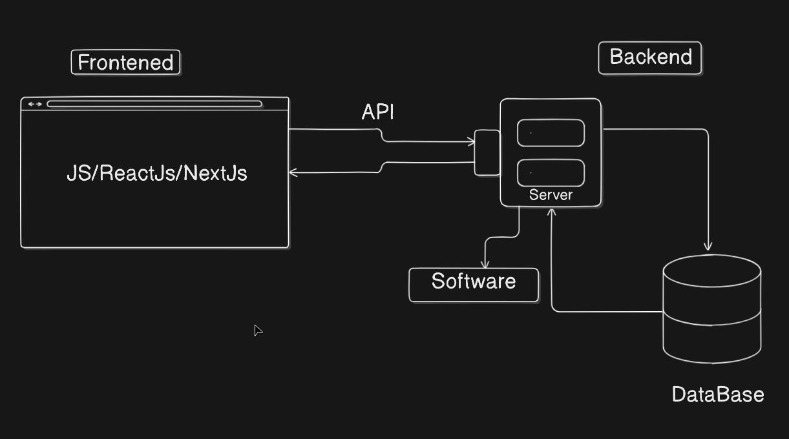

Node.js is a free, open-source, cross-platform JavaScript runtime environment that allows you to run JavaScript code outside of a web browser, typically on a server. It is built on Chrome's V8 JavaScript engine and enables server-side development with JavaScript, allowing the creation of scalable network applications efficiently.

Node.js uses an asynchronous, event-driven, non-blocking I/O model, which makes it highly efficient for handling many simultaneous connections and I/O-heavy operations such as real-time applications, APIs, data streaming, and command-line tools. It operates primarily on a single-threaded event loop that can handle multiple tasks concurrently without waiting for each to complete.

Node.js files typically have a `.js` extension and are executed on the server using the `node` command.



```jsx
const fs = require('fs') // file system required
```

### Let's Learn Backend by Project

First we have to create a project for a Backend whose name will be "Project Management Application". Then we have to create a file with the help of Terminal:

```bash
npm install
```

Then create a file and after that json file will be created:

```json
{
  "name": "projectmanagement",
  "version": "1.0.0",
  "description": "A project management application for beginners",
  "main": "index.js",
  "scripts": {
    "dev": "node index.js"
  },
  "keywords": [
    "Backend",
    "APIs",
    "creation"
  ],
  "author": "Dev Hari Ojha",
  "license": "ISC"
}
```

The term "dev" defined in the terminal is used to run the code which is written in the `index.js` file:

```bash
npm run dev
```

### Prettier

Prettier is an opinionated code formatter. It removes all original styling and ensures that all outputted code conforms to a consistent style. Prettier takes your code and reprints it from scratch by taking the line length into account.

For example, take the following code:

```jsx
foo(arg1, arg2, arg3, arg4);
```

It fits in a single line so it’s going to stay as is. However, we've all run into this situation:

```jsx
foo(reallyLongArg(), omgSoManyParameters(), IShouldRefactorThis(), isThereSeriouslyAnotherOne());
```

Suddenly, our previous format for calling function breaks down because this is too long. Prettier is going to do the painstaking work of reprinting it like that for you:

```jsx
foo(
  reallyLongArg(),
  omgSoManyParameters(),
  IShouldRefactorThis(),
  isThereSeriouslyAnotherOne(),
);
```

Prettier enforces a consistent code **style** (i.e. code formatting that won’t affect the AST) across your entire code base because it disregards the original styling by parsing it away and re-printing the parsed AST with its own rules that take the maximum line length into account, wrapping code when necessary.

### Installation of Prettier in Code

To install Prettier, write the code in Terminal:

```bash
npm install --save-dev --save-exact prettier
```

`prettier --write .` is great for formatting everything, but for a big project it might take a little while. You may run `prettier --write app/` to format a certain directory, or `prettier --write app/components/Button.js` to format a certain file.

```bash
npx prettier . --write
```

We have to make some files to secure our code like `.prettierignore` and `.gitignore` files. In both files we have to ignore files like:

```
node_modules
.env
```

### Nodemon

Nodemon is a tool that helps develop Node.js based applications by automatically restarting the node application when file changes in the directory are detected.

#### Install Nodemon globally

```bash
npm install -g nodemon
```

#### Install Nodemon locally (as a development dependency)

```bash
npm install --save-dev nodemon
```

### How to Secure important variables which are not provided in code

#### dotenv

Dotenv is a zero-dependency module that loads environment variables from a `.env` file into `process.env`. Storing configuration in the environment separate from code is based on [The Twelve-Factor App](https://12factor.net/config) methodology.

A `.env` file is a simple text file used to store environment variables, typically for development and configuration purposes. It's a common practice to use it to manage settings like API keys, database credentials, and other application-specific information that might change between environments (development, testing, production).

#### Install

```bash
npm install dotenv --save
```

Create `.env` file and store the important variables into it:

```env
username = Dev
database = Mango
```

Then import the `.env` file in `index.js` file:

```javascript
import dotenv from "dotenv"

dotenv.config({
  path: "./.env"
})
let myUsername = process.env.username;
console.log("value:", myUsername);
console.log("Start the Project");
```

Output:

```
value : Dev
Start the Project
```

[Express JS](express-js.md)

[Postman](postman.md)
