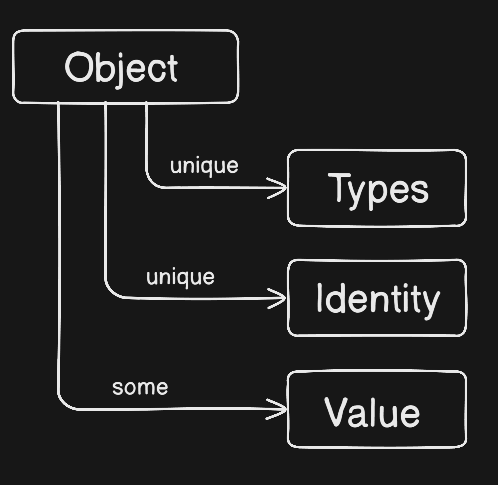
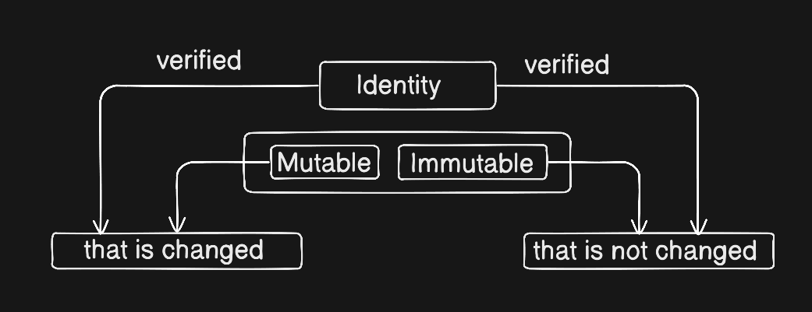

## Objects

Everything is defined as an Object in Python. Objects have a `unique` identity, `unique` types, and hold `some` values. Objects can be `mutable` or `immutable`.



## Mutable or Immutable

`Mutable` is an object that is changeable, and `Immutable` is an object that is not changeable.

We can check whether it is changeable or not through `Identity` (the `id()` function):



## Variables

Variables are used to store values or data.

```python
sugar_amount = 100
print(f"Initial sugar amount: {sugar_amount} grams ")
# output = Initial sugar amount: 100 grams
```

```python
sugar_amount = 100  
print (f"Initial sugar amount: {sugar_amount} grams") 

sugar_amount = 20  
print (f"Initial sugar amount: {sugar_amount} grams")
# output = Initial sugar amount: 100 grams
# output = Initial sugar amount: 20 grams
```

**Note:** Python allows **reassigning variables**.

**Reason:**
- First, `sugar_amount` is assigned **100**, so it prints `100 grams`.
- Then, `sugar_amount` is reassigned to **20**, so it prints `20 grams`.
- We can also check by their `identity` because it is unique.

```python
sugar_amount = 100  
print (f"Initial sugar amount: {sugar_amount} grams") 

sugar_amount = 20  
print (f"Initial sugar amount: {sugar_amount} grams")
# output = Initial sugar amount: 100 grams
# output = Initial sugar amount: 20 grams

print(f"ID of 2: {id(2)}")
print(f"ID of 12: {id(12)}")
# output = ID of 2: 140718419309512
# output = ID of 12: 140718419309832  
# Both are unique identities 
```

```python
sugar_amount = 100  
sugar_amount = 20  
print (sugar_amount)
# output = 20 
```

It would be wrong **only if you expect the old value to stay** without saving it, because `100` is lost.

## Numbers

Numbers are divided into `integers`, `booleans`, `real numbers` (floats), `complex numbers`, etc.

- **Integers:** Numerical values without decimal points used in Python.

```python
## Integers
print(2 + 3) # Addition
print(2 - 3) # Subtraction
print(2 * 3) # Multiplication
print(2 / 3) # Division
print(2 ** 3)   # Exponentiation Power 
print(2 // 3)   # Floor Division
print(2 % 3)    # Modulus
```

- **Boolean:** Used to define True or False (1 or 0).

```python
# Boolean
if_dev = 0
print(bool(if_dev))  # False
if_dev = 1
print(bool(if_dev))  # True
```

- **Logical Operators:** Can consist of `and`, `or`, `not`.

```python
# Logical Operators
water_added = True
sugar_added = False
print(water_added and sugar_added)  # False because both require True
print(water_added or sugar_added)   # True if any one is True
print(not water_added)               # False
```

## Strings

A String defines a sequence of characters and is immutable.

```python
name = "John"
print(name)
```

**Indexing:** Indexing is used to access individual characters in a string using their position.

```python
name = "Python"
print(name[0])   # P (first character)
print(name[1])   # y (second character)
print(name[-1])  # n (last character)
print(name[-2])  # o (second last character)
```

**Note:** Python uses **zero-based indexing**, meaning the first character is at index `0`.

**Slicing:** Slicing is used to extract a portion of a string using the syntax `[start:stop:step]`.

```python
name = "Python"
print(name[0:3])    # Pyt (characters from index 0 to 2)
print(name[2:])     # thon (from index 2 to end)
print(name[:4])     # Pyth (from start to index 3)
print(name[::2])    # Pto (every 2nd character)
print(name[::-1])   # nohtyP (reverse the string)
```

```python
# Practical Example
fruit = "Strawberry"
print(f"First 5 letters: {fruit[:5]}")      # Straw
print(f"Last 5 letters: {fruit[-5:]}")     # berry
print(f"Every other letter: {fruit[::2]}") # Srwer

text = "Hello, World!"
print(text[0])  # Output: 'H'
print(text[7])  # Output: 'W'
print(text[:5])  # Output: 'Hello'
print(text[7:])  # Output: 'World!'
print(text[::2])  # Output: 'Hlo ol!'
print (f"First Word : {text[0:8]}")
```

## Tuples

Tuples in Python are used to store `multiple values` in a single variable. They are similar to lists, but one key difference is that `tuples are immutable`. Tuples always use parentheses `()`.

```python
masala_chai = ("10","20","30","40","50")
print(masala_chai)
```

**Membership:** Membership tests check if a given value is part of a variable or collection.

```python
# Membership Test
print("10" in masala_chai)  # Output: True
print("90" in masala_chai)  # Output: False
```

## Lists

A List is defined as a dynamic array in Python. It stores `multiple values`, uses `index numbers`, allows looping, and can be `modified (mutable)`.

```python
# List
ingredients = ["flour", "sugar", "eggs", "butter", "milk"]
ingredients.append("vanilla extract")
print(f"Ingredients: {ingredients}") 
ingredients.remove("sugar")
print(f"Ingredients after removing sugar: {ingredients}")
ingredients.insert(2, "baking powder")
print(f"Ingredients after adding baking powder: {ingredients}") 
ingredients.reverse()
print(f"Reversed ingredients: {ingredients}")
last_items= ingredients.pop()
print(f"Last items: {last_items}")
print(f"Ingredients after popping last item: {ingredients}")
ingredients.sort()
print(f"Sorted ingredients: {ingredients}")

ingredients_level = [1,2,3,4,5]
print(f"Ingredients level: {max(ingredients_level)}")
print(f"Ingredients level: {min(ingredients_level)}")

# Operator Overloading
list1 = [1, 2, 3]
list2 = [4, 5, 6]
Concatenated = list1 + list2
print(f"Concatenated list: {Concatenated}") 
print(f"Repeated list: {Concatenated * 3}")  

# Bytearray
byte_array = bytearray(b"Hello, World!")
newByte_array = byte_array.replace(b"World", b"Python")
print(f"Modified bytearray: {newByte_array}")
```

#### Output Example:
```
Ingredients: ['flour', 'sugar', 'eggs', 'butter', 'milk', 'vanilla extract']
Ingredients after removing sugar: ['flour', 'eggs', 'butter', 'milk', 'vanilla extract']
Ingredients after adding baking powder: ['flour', 'eggs', 'baking powder', 'butter', 'milk', 'vanilla extract']
Reversed ingredients: ['vanilla extract', 'milk', 'butter', 'baking powder', 'eggs', 'flour']
Last items: flour
Ingredients after popping last item: ['vanilla extract', 'milk', 'butter', 'baking powder', 'eggs']
Sorted ingredients: ['baking powder', 'butter', 'eggs', 'milk', 'vanilla extract']
Ingredients level: 5
Ingredients level: 1
Concatenated list: [1, 2, 3, 4, 5, 6]
Repeated list: [1, 2, 3, 4, 5, 6, 1, 2, 3, 4, 5, 6, 1, 2, 3, 4, 5, 6]
Modified bytearray: bytearray(b'Hello, Python!')
```

## Sets

A **set** in Python is a **collection of unordered, unique elements**.

```python
# Set
essential_spices = {"salt", "pepper", "cumin", "paprika", "turmeric"}
optional_spices = {"oregano", "basil", "thyme", "rosemary","salt"}
all_spices = essential_spices | optional_spices # Union of two sets
print(f"All spices: {all_spices}")  
common_spices = essential_spices & optional_spices
print(f"Common spices: {common_spices}") # Intersection of two sets
unique_essential_spices = essential_spices - optional_spices
print(f"Unique essential spices: {unique_essential_spices}") # Difference of two sets
symmetric_diff_spices = essential_spices ^ optional_spices
print(f"Symmetric difference of spices: {symmetric_diff_spices}") # Symmetric difference of two sets
```

#### Output Example:
```
All spices: {'cumin', 'pepper', 'basil', 'paprika', 'thyme', 'oregano', 'rosemary', 'salt', 'turmeric'}
Common spices: {'salt'}
Unique essential spices: {'cumin', 'paprika', 'turmeric', 'pepper'}
Symmetric difference of spices: {'cumin', 'thyme', 'oregano', 'rosemary', 'turmeric', 'pepper', 'basil', 'paprika'}
```

## Dictionaries

A collection of key-value pair items.

```python
# Dictionary
my_dict = {
    "name": "Dev",
    "age": 20,
    "city": "Lucknow"
}
print(my_dict["name"])

chai_store = {"type": "Masala Chai","note":"Less sweet", "size": "Medium","sugar":1,}
last_item = chai_store.popitem()
print(last_item)

customer_note = chai_store.get("note", "No special notes")
print(customer_note)
```

## Advanced Data Types

There are some additional helpful collections and types in Python:

```python
import arrow
current_time = arrow.now()
print(current_time.format('YYYY-MM-DD HH:mm:ss'))

from collections import namedtuple
Point = namedtuple('Point', ['x', 'y'])
p = Point(10, 20)
print(p.x, p.y)

# There are more options for collections. Read the official Python docs!
```
