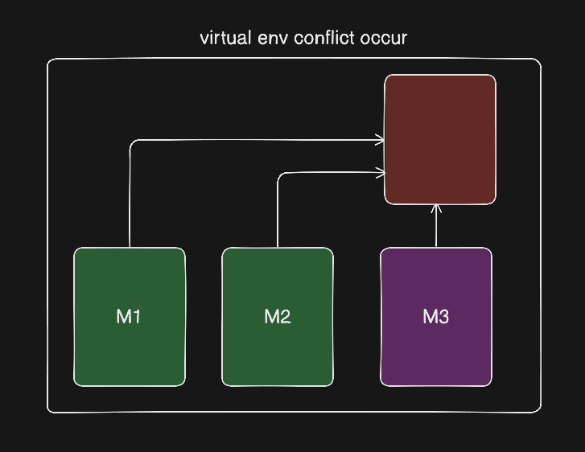
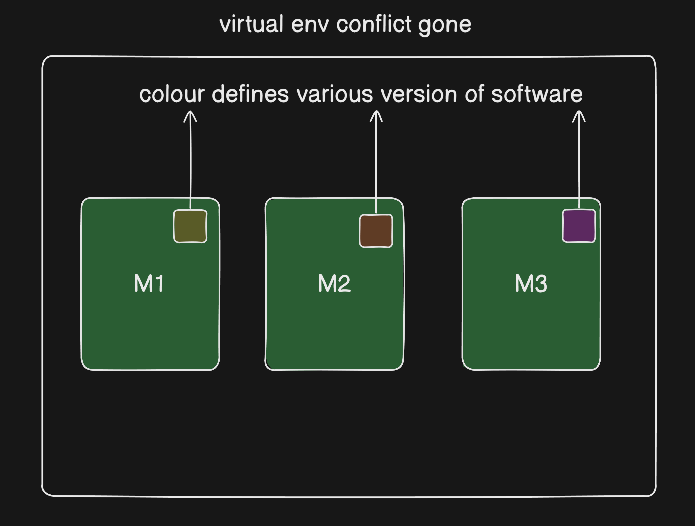

**What is Python?**
Python is a popular programming language. It was created by **Guido van Rossum,** and released in **1991.**

**It is used for:**
- web development (server-side),
- software development,
- mathematics,
- system scripting.

**What can Python do?**
- Python can be used on a server to create web applications.
- Python can be used alongside software to create workflows.
- Python can connect to database systems. It can also read and modify files.
- Python can be used to handle big data and perform complex mathematics.
- Python can be used for rapid prototyping, or for production-ready software development.

**Why Python?**
- Python works on different platforms (Windows, Mac, Linux, Raspberry Pi, etc).
- Python has a simple syntax similar to the English language.
- Python has syntax that allows developers to write programs with fewer lines than some other programming languages.
- Python runs on an interpreter system, meaning that code can be executed as soon as it is written. This means that prototyping can be very quick.
- Python can be treated in a procedural way, an object-oriented way or a functional way.

**Good to know**
- The most recent major version of Python is Python 3, which we shall be using in this tutorial.
- In this tutorial Python will be written in a text editor. It is possible to write Python in an Integrated Development Environment, such as Thonny, Pycharm, Netbeans or Eclipse which are particularly useful when managing larger collections of Python files.

**Python Syntax compared to other programming languages**
- Python was designed for readability, and has some similarities to the English language with influence from mathematics.
- Python uses new lines to complete a command, as opposed to other programming languages which often use semicolons or parentheses.
- Python relies on indentation, using whitespace, to define scope; such as the scope of loops, functions and classes. Other programming languages often use curly-brackets for this purpose.

```python
print ("Hello Python")
```

## Python Installation

- To run Python on your own computer, follow the instructions below.
- Many Windows PCs and Macs already have Python pre-installed.
- To check if Python is installed on Windows, search for Python in the start bar or run the following on the Command Line (cmd.exe):

```powershell
C:\Users\Your Name>python --version
```

then :

```powershell
python --version
```

**Note :** If Python is not installed on your computer, you can download it for free from the official website: [https://www.python.org/](https://www.python.org/)

## Virtual Environment

A **virtual environment** is a tool in Python that creates a **separate environment** with its own Python interpreter and libraries, so different projects can use **different package versions** without conflicts.

Python ka **virtual environment** ek **isolated space** hai jahan hum project ke liye zaroori libraries install karte hain. Isse **system Python** ya dusre projects par koi asar nahi pdta.

**Ex** - Ek project ko **Django 3.2** chahiye aur dusre ko **Django 4.0**, to dono virtual environment me safely use ho sakte hain. 





### Setup of Virtual Environment :

```bash
python -m venv venv
```

`python -m venv venv` is a **command used to create a Python virtual environment** named **`venv`** in the current directory.

| Part | Meaning |
| --- | --- |
| `python` | Runs the Python interpreter |
| `-m` | Tells Python to run a **module** |
| `venv` | Built-in Python module used to create virtual environments |
| `venv` | Name of the virtual environment folder |

```bash
venv\Scripts\activate
```

`venv\Scripts\activate` is a **command used to activate a Python virtual environment** on **Windows**.

| Part | Meaning |
| --- | --- |
| `venv` | Virtual environment folder |
| `Scripts` | Contains activation and Python executable files (Windows-specific) |
| `activate` | Script that **activates** the virtual environment |

```bash
(venv) //output come in terminal
```

it is traditional way to install the `venv` in code  but we are going to use `uv`  method to install it 
https://peps.python.org/pep-0008/
