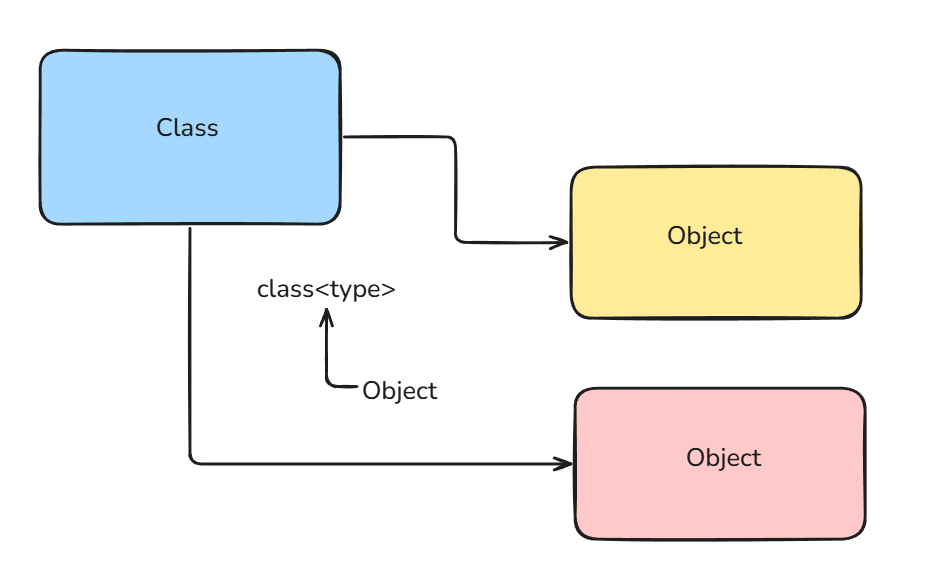

Object-Oriented Programming (OOP) is a programming paradigm that uses **objects** and **classes** to structure software into reusable blueprints.

## Classes and Objects

A **Class** is defined as a blueprint or template for creating objects. In Python, everything is an object, and all classes themselves are objects of type `type`.



```python
class Tshirt:
  pass
class Shirt:
  pass

print(type(Tshirt))
veirdo = Tshirt()

print(type(veirdo))
print(type(veirdo) is Tshirt)
print(type(veirdo) is Shirt)
```

## Attribute Shadowing

**Attribute shadowing** in Python occurs when an attribute defined with the same name in a "closer" or narrower scope hides an attribute with that same name in an outer scope (such as a class attribute shadowed by an instance attribute).

```python
class A:
    x = 10      # Class attribute

obj = A()
obj.x = 99      # Instance attribute shadows A.x

print(obj.x)    # Output: 99
print(A.x)      # Output: 10
```

## Inheritance

**Inheritance** allows you to create a new class (child class) from an existing class (parent class), meaning the child class *is a kind of* parent class. 

The child class automatically inherits all attributes and methods of the parent class, and it can also override or extend them with its own custom functionality.

```python
class Animal:
    def speak(self):
        return "..."

class Dog(Animal):          # Dog is an Animal
    def speak(self):
        return "Woof!"

d = Dog()
print(d.speak())            # Output: Woof!
```

```python
# Class is created 
class newCloth:
  def __init__(self, type_):
    self.type = type_
  
  def prepare(self):
    print(f"Preparing {self.type} clothes")

# Inheritance starts: inherit Cloth from newCloth
class Cloth(newCloth):
  def add_cloth(self):
    print(f"Adding Jeans, Shirt, Trousers")

class ClothShop:
  cloth_cls = newCloth

  def __init__(self):
    self.cloth = self.cloth_cls("Regular Cloth")

  def serve(self):
    print(f"Serving {self.cloth.type} in the shop")
    self.cloth.prepare()

class FancyClothShop(ClothShop):
  cloth_cls = Cloth

shop = ClothShop()
shop.serve()
```

## Composition

**Composition** means building a class by *containing* other objects inside it. Your class *has a* component object and utilizes it to perform work, representing a "has-a" relationship rather than an "is-a" relationship.

```python
class Engine:
    def start(self):
        return "Engine started"

class Car:
    def __init__(self):
        self.engine = Engine()     # Car has an Engine

    def start(self):
        return self.engine.start()

c = Car()
print(c.start())                    # Output: Engine started
```
