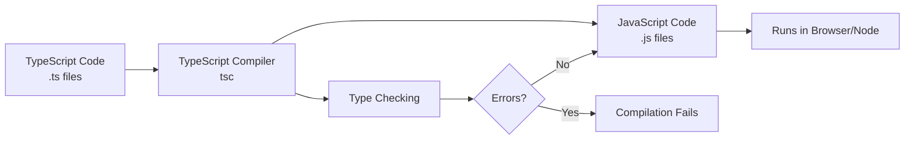
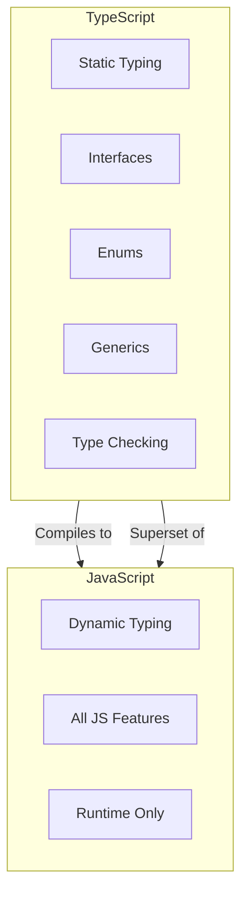
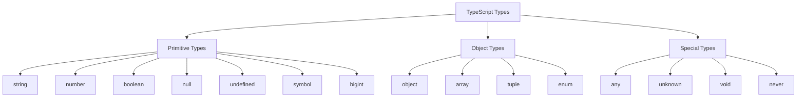
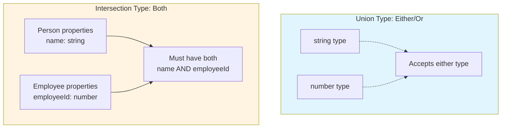
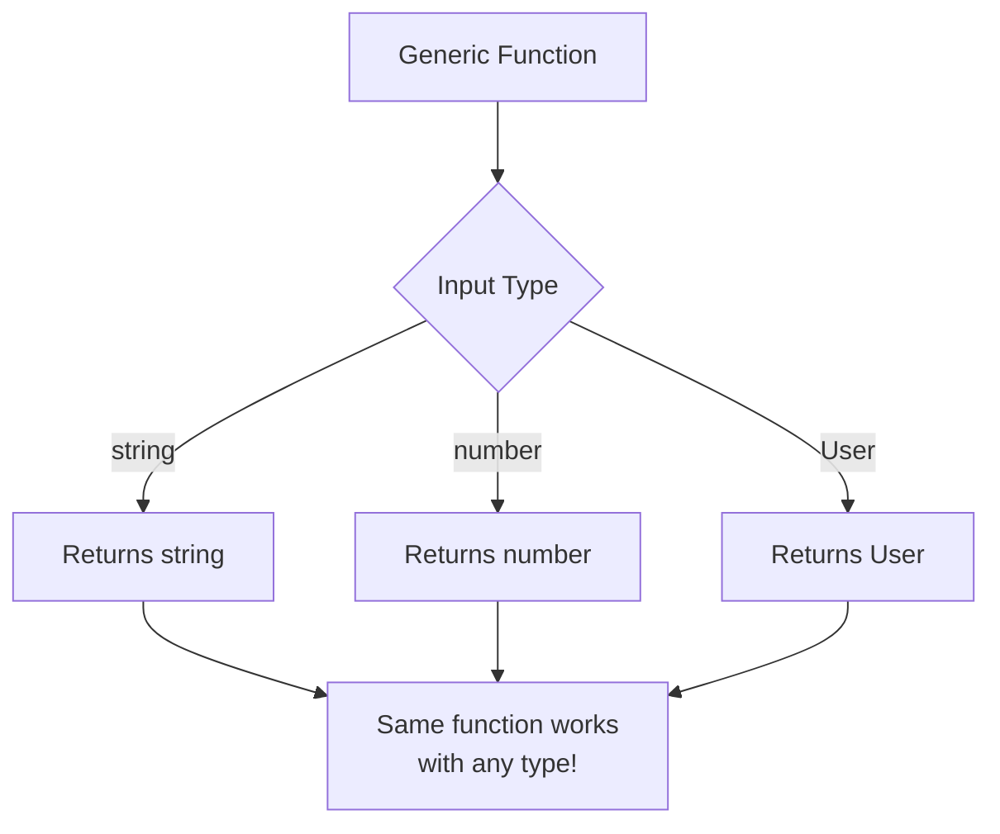
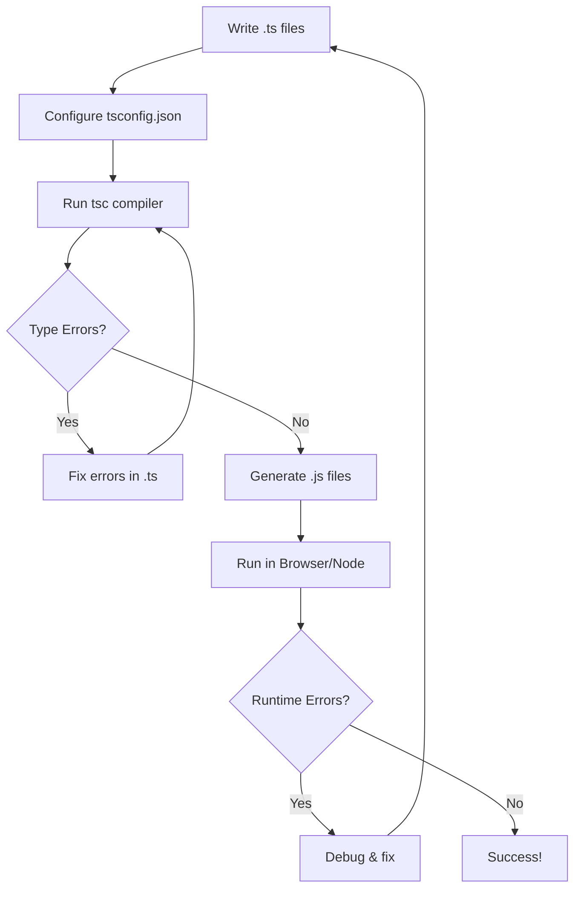

**TypeScript** is a high-level, strongly typed programming language that builds on JavaScript by adding _static typing_ through optional type annotations.

### Definition and History

**TypeScript** is an open-source programming language developed and maintained by **Microsoft**.

**Key Facts:**

- **Developed by:** Microsoft
- **Lead Designer:** Anders Hejlsberg (also creator of C# and Turbo Pascal)
- **First Release:** October 1, 2012
- **Current Status:** Actively maintained and widely adopted
- **License:** Apache License 2.0

TypeScript is a _superset_ of JavaScript, meaning all valid JavaScript code is also valid TypeScript code. It adds optional static type checking, interfaces, classes, and other features that compile down to plain JavaScript that can run in any browser or JavaScript runtime.

### TypeScript Compilation Flow



**How it works:**

1. Write TypeScript code with type annotations
2. TypeScript compiler (`tsc`) checks types
3. If no errors, compiler removes types and generates JavaScript
4. JavaScript runs in any environment

### TypeScript vs JavaScript



**Key Differences:**

- TypeScript = JavaScript + Static Types
- TypeScript catches errors at **compile time**
- JavaScript catches errors at **runtime**
- TypeScript requires compilation step
- JavaScript runs directly in browsers

### Basic Types

TypeScript provides several basic types to help you work with values:



**Primitive Types:**

- `string` - Textual data
- `number` - Numeric values (integers and floats)
- `boolean` - True or false values
- `null` - Intentional absence of value
- `undefined` - Uninitialized value
- `symbol` - Unique identifiers
- `bigint` - Large integers

**Special Types:**

- `any` - Disables type checking
- `unknown` - Type-safe alternative to any
- `void` - Absence of return value
- `never` - Values that never occur

### Type Annotations

Explicitly declare types for variables, parameters, and return values:

```tsx
let name: string = "Alice";
let age: number = 30;
let isActive: boolean = true;

function greet(name: string): string {
  return `Hello, ${name}!`;
}
```

### Arrays and Tuples

**Arrays** store collections of values:

```tsx
let numbers: number[] = [1, 2, 3];
let strings: Array<string> = ["a", "b", "c"];
```

**Tuples** are fixed-length arrays with specific types:

```tsx
let person: [string, number] = ["Alice", 30];
```

### Objects and Interfaces

**Interfaces** define the structure of objects:

```tsx
interface User {
  id: number;
  name: string;
  email?: string; // Optional property
  readonly createdAt: Date; // Read-only property
}

const user: User = {
  id: 1,
  name: "Alice",
  createdAt: new Date(),
};
```

**Index Signatures** allow dynamic property names:

```tsx
interface StringMap {
  [key: string]: string;
}
```

### Type Aliases

Create custom type names for reusability:

```tsx
type ID = string | number;
type UserRole = "admin" | "user" | "guest";

type Point = {
  x: number;
  y: number;
};
```

### Union and Intersection Types

```mermaid
graph TD
    A["Union Types: Type A OR Type B"] --> A1["Uses pipe symbol"
    A1 --> A2["Example: string OR number"]
    A2 --> A3["✓ Can be a string"]
    A2 --> A4["✓ Can be a number"]

    B["Intersection Types: Type A AND Type B"] --> B1["Uses ampersand symbol"]
    B1 --> B2["Example: Person AND Employee"]
    B2 --> B3["✓ Must have ALL properties"]

    style A fill:#e1f5ff
    style B fill:#fff4e1
```

**Visual Comparison:**



**Union Types** allow multiple type options:

```tsx
let value: string | number;
value = "hello"; // Valid
value = 42; // Valid
```

**Intersection Types** combine multiple types:

```tsx
type Person = { name: string };
type Employee = { employeeId: number };

type Staff = Person & Employee;
// Must have both name and employeeId
```

### Functions

Type functions with parameters and return types:

```tsx
function add(a: number, b: number): number {
  return a + b;
}

// Arrow function
const multiply = (a: number, b: number): number => a * b;

// Optional parameters
function greet(name: string, greeting?: string): string {
  return `${greeting || "Hello"}, ${name}!`;
}

// Default parameters
function createUser(name: string, role: string = "user") {
  return { name, role };
}

// Rest parameters
function sum(...numbers: number[]): number {
  return numbers.reduce((acc, n) => acc + n, 0);
}
```

**Function Types:**

```tsx
type MathOperation = (a: number, b: number) => number;

const divide: MathOperation = (a, b) => a / b;
```

### Classes

Object-oriented programming with classes:

```tsx
class Animal {
  private name: string; // Private property
  protected age: number; // Protected property
  public species: string; // Public property

  constructor(name: string, age: number, species: string) {
    this.name = name;
    this.age = age;
    this.species = species;
  }

  public makeSound(): void {
    console.log("Some sound");
  }
}

class Dog extends Animal {
  constructor(name: string, age: number) {
    super(name, age, "Dog");
  }

  public makeSound(): void {
    console.log("Woof!");
  }
}
```

**Abstract Classes:**

```tsx
abstract class Shape {
  abstract area(): number;

  describe(): string {
    return `Area: ${this.area()}`;
  }
}
```

### Generics

Create reusable components that work with multiple types:



**Why use Generics?**

- Write code once, use with many types
- Maintain type safety
- Avoid code duplication

```tsx
function identity<T>(arg: T): T {
  return arg;
}

let output = identity<string>("hello");

// Generic interfaces
interface Box<T> {
  value: T;
}

const numberBox: Box<number> = { value: 42 };
const stringBox: Box<string> = { value: "hello" };

// Generic classes
class GenericStack<T> {
  private items: T[] = [];

  push(item: T): void {
    this.items.push(item);
  }

  pop(): T | undefined {
    return this.items.pop();
  }
}

// Generic constraints
function getLength<T extends { length: number }>(arg: T): number {
  return arg.length;
}
```

### Enums

Define named constants:

```tsx
// Numeric enum
enum Direction {
  Up,
  Down,
  Left,
  Right,
}

// String enum
enum Status {
  Active = "ACTIVE",
  Inactive = "INACTIVE",
  Pending = "PENDING",
}

// Const enum (optimized at compile time)
const enum Color {
  Red = "#FF0000",
  Green = "#00FF00",
  Blue = "#0000FF",
}
```

### Type Assertions

Tell TypeScript the specific type of a value:

```tsx
let someValue: unknown = "this is a string";

// Angle-bracket syntax
let strLength1: number = (<string>someValue).length;

// As syntax (preferred in JSX)
let strLength2: number = (someValue as string).length;
```

### Type Guards

Narrow down types within conditional blocks:

```mermaid
graph TD
    A[value: string | number] --> B{typeof value?}
    B -->|string| C[TypeScript knows:<br/>value is string]
    B -->|number| D[TypeScript knows:<br/>value is number]
    C --> E[Can use string methods]
    D --> F[Can use number methods]
```

```tsx
// typeof guard
function print(value: string | number) {
  if (typeof value === "string") {
    console.log(value.toUpperCase());
  } else {
    console.log(value.toFixed(2));
  }
}

// instanceof guard
class Car {}
class Bike {}

function drive(vehicle: Car | Bike) {
  if (vehicle instanceof Car) {
    // vehicle is Car
  }
}

// Custom type guard
function isString(value: unknown): value is string {
  return typeof value === "string";
}
```

### Literal Types

Exact values as types:

```tsx
let direction: "up" | "down" | "left" | "right";
direction = "up"; // Valid

type HttpMethod = "GET" | "POST" | "PUT" | "DELETE";

function request(method: HttpMethod, url: string) {
  // Implementation
}
```

### Utility Types

Built-in type transformations:

**Partial** - Makes all properties optional:

```tsx
interface User {
  name: string;
  age: number;
}

type PartialUser = Partial<User>;
// { name?: string; age?: number; }
```

**Required** - Makes all properties required:

```tsx
type RequiredUser = Required<PartialUser>;
```

**Readonly** - Makes all properties read-only:

```tsx
type ReadonlyUser = Readonly<User>;
```

**Pick** - Select specific properties:

```tsx
type UserName = Pick<User, "name">;
// { name: string; }
```

**Omit** - Exclude specific properties:

```tsx
type UserWithoutAge = Omit<User, "age">;
// { name: string; }
```

**Record** - Create object type with specific keys:

```tsx
type Roles = Record<string, boolean>;
// { [key: string]: boolean; }
```

**ReturnType** - Extract function return type:

```tsx
function getUser() {
  return { name: "Alice", age: 30 };
}

type User = ReturnType<typeof getUser>;
```

### Mapped Types

Transform properties of existing types:

```tsx
type Nullable<T> = {
  [P in keyof T]: T[P] | null;
};

type Optional<T> = {
  [P in keyof T]?: T[P];
};

type Getters<T> = {
  [P in keyof T as `get${Capitalize<string & P>}`]: () => T[P];
};
```

### Conditional Types

Types that depend on conditions:

```tsx
type IsString<T> = T extends string ? true : false;

type A = IsString<string>; // true
type B = IsString<number>; // false

// With infer
type UnwrapPromise<T> = T extends Promise<infer U> ? U : T;

type Result = UnwrapPromise<Promise<string>>; // string
```

### Modules

**Export:**

```tsx
// Named exports
export const PI = 3.14;
export function add(a: number, b: number) {
  return a + b;
}

// Default export
export default class Calculator {}
```

**Import:**

```tsx
import Calculator from "./calculator";
import { PI, add } from "./math";
import * as MathUtils from "./math";
```

### Namespaces

Organize code into logical groups:

```tsx
namespace Geometry {
  export interface Point {
    x: number;
    y: number;
  }

  export function distance(p1: Point, p2: Point): number {
    return Math.sqrt((p2.x - p1.x) ** 2 + (p2.y - p1.y) ** 2);
  }
}

const point: Geometry.Point = { x: 0, y: 0 };
```

### Decorators

Add metadata and modify classes (experimental feature):

```tsx
function sealed(constructor: Function) {
  Object.seal(constructor);
  Object.seal(constructor.prototype);
}

@sealed
class Greeter {
  greeting: string;
  constructor(message: string) {
    this.greeting = message;
  }
}
```

### Type Inference

TypeScript automatically infers types:

```mermaid
graph LR
    A[let x = 3] --> B[TypeScript infers:<br/>x is number]
    C[let arr = [1, 2, 3]] --> D[TypeScript infers:<br/>arr is number array]
    E[No explicit type<br/>annotation needed!]
```

```tsx
let x = 3; // inferred as number
let y = [0, 1, null]; // inferred as (number | null)[]

function createPair(x: number, y: number) {
  return { x, y }; // inferred return type: { x: number; y: number; }
}
```

### Type Compatibility

Structural type system (duck typing):

```tsx
interface Point {
  x: number;
  y: number;
}

function logPoint(p: Point) {
  console.log(`${p.x}, ${p.y}`);
}

const point = { x: 12, y: 26 };
logPoint(point); // Works! Structural compatibility

const point3d = { x: 12, y: 26, z: 89 };
logPoint(point3d); // Also works! Extra properties OK
```

### Advanced Types

**Template Literal Types:**

```tsx
type World = "world";
type Greeting = `hello ${World}`; // "hello world"

type Color = "red" | "blue";
type Size = "small" | "large";
type Variant = `${Color}-${Size}`; // "red-small" | "red-large" | "blue-small" | "blue-large"
```

**Discriminated Unions:**

```tsx
interface Circle {
  kind: "circle";
  radius: number;
}

interface Square {
  kind: "square";
  sideLength: number;
}

type Shape = Circle | Square;

function getArea(shape: Shape): number {
  switch (shape.kind) {
    case "circle":
      return Math.PI * shape.radius ** 2;
    case "square":
      return shape.sideLength ** 2;
  }
}
```

**Index Access Types:**

```tsx
type Person = { name: string; age: number };
type Age = Person["age"]; // number
```

### Declaration Files

Provide type information for JavaScript libraries:

```tsx
// types.d.ts
declare module "my-library" {
  export function greet(name: string): string;
}

// Ambient declarations
declare const API_KEY: string;
declare function globalFunction(): void;
```

### Null and Undefined Handling

**Non-null assertion operator:**

```tsx
function getValue(key: string): string | undefined {
  return undefined;
}

const value = getValue("key")!; // Assert non-null
```

**Nullish coalescing:**

```tsx
const value = getValue("key") ?? "default";
```

**Optional chaining:**

```tsx
const user = { address: { street: "Main St" } };
const street = user?.address?.street;
```

### Type Narrowing

Refine types through code analysis:

```tsx
function process(value: string | null) {
  if (value !== null) {
    // value is string here
    console.log(value.toUpperCase());
  }
}

function example(x: string | number) {
  if (typeof x === "string") {
    return x.length;
  }
  return x.toFixed(2);
}
```

### TypeScript Development Flow



### tsconfig.json

Configure TypeScript compiler:

```tsx
{
  "compilerOptions": {
    "target": "ES2020",
    "module": "commonjs",
    "lib": ["ES2020", "DOM"],
    "strict": true,
    "esModuleInterop": true,
    "skipLibCheck": true,
    "forceConsistentCasingInFileNames": true,
    "outDir": "./dist",
    "rootDir": "./src",
    "declaration": true,
    "sourceMap": true
  },
  "include": ["src/**/*"],
  "exclude": ["node_modules", "**/*.spec.ts"]
}
```

### Best Practices

**Enable strict mode:**

- Use `"strict": true` in tsconfig.json
- Catches more potential errors
- Enforces better type safety

**Avoid `any` type:**

- Use `unknown` for truly unknown types
- Prefer specific types or unions

**Use type inference:**

- Let TypeScript infer types when obvious
- Add explicit types for function parameters and return values

**Prefer interfaces for objects:**

- Use interfaces for object shapes
- Use type aliases for unions, intersections, and primitives

**Use const assertions:**

```tsx
const colors = ["red", "green", "blue"] as const;
type Color = (typeof colors)[number]; // "red" | "green" | "blue"
```
