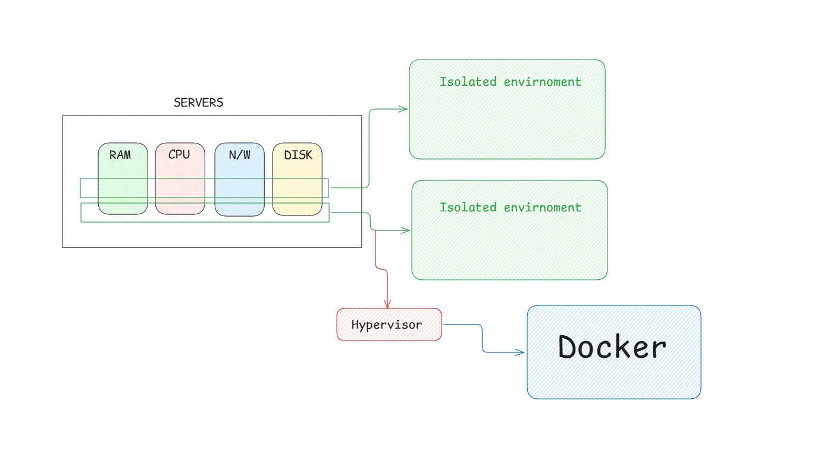
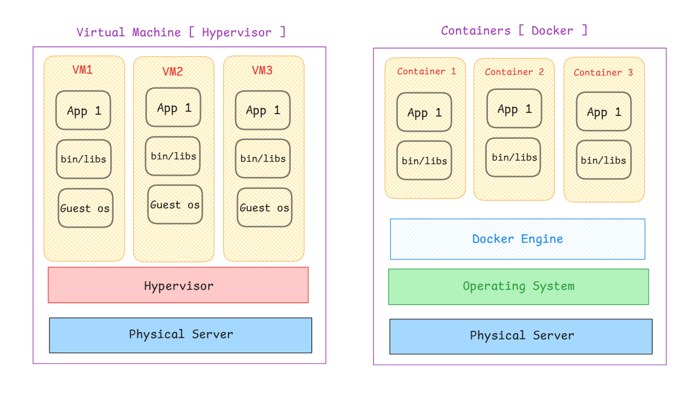
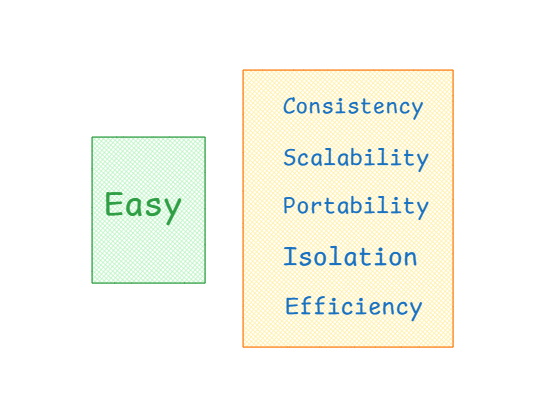

# Docker

## Overview



A server contains **RAM**, **CPU**, **Network devices**, and **Storage devices** (Disk). On top of the operating system, we install applications like Node.js or Java. The problem is — when an application doesn't use 100% CPU, the rest of the resources go to waste.

### Hypervisor (Virtual Machines)

A **Hypervisor** is management software that fragments physical resources (CPU, RAM, Disk, Network) into isolated environments — each being a fully functional operating system called a **Virtual Machine (VM)**.

### Docker (Containers)

Sometimes you need something more lightweight than a VM. **Docker** is an engine designed to be faster and more lightweight than traditional hypervisors.

## Virtual Machine vs Containers



| Virtual Machine | Docker Containers |
| --- | --- |
| Runs on a **hypervisor** | Runs on **Docker Engine** |
| Each VM contains its own **guest OS** | Containers **share the host OS** |
| **Heavyweight** — every VM includes a full OS | **Lightweight** — only app + binaries/libraries |
| Starts **slower** | Starts **faster** |
| Uses **more memory and disk** | Uses **less memory and disk** |
| Better isolation (separate OS per VM) | Good enough isolation for most apps |
| Best for running **different OS** on one server | Best for running **multiple apps** efficiently on one OS |

In simple terms:
- A **VM** is a full computer inside another computer, including a guest OS.
- A **container** is a lightweight package that shares the host OS.

## Why Developers Should Use Containers



- **Consistency** — Works the same on development, staging, and production.
- **Isolation** — Each container runs independently.
- **Portability** — Run anywhere: Linux, Mac, Windows.
- **Efficiency** — Lightweight, fast startup, low overhead.
- **Scalability** — Easy to scale horizontally with orchestration tools.

## Installation of Docker

- **Windows** — [Install Docker Desktop on Windows](https://docs.docker.com/desktop/setup/install/windows-install/)
- **Mac** — [Install Docker Desktop on Mac](https://docs.docker.com/desktop/setup/install/mac-install/)
- **Linux** — [Install Docker Desktop on Linux](https://docs.docker.com/desktop/setup/install/linux/)

## Key Docker Concepts

### Docker Images

A **Docker image** is a lightweight, standalone, executable package that includes everything needed to run software: code, runtime, libraries, environment variables, and configuration.

- **Layers** — Built layer by layer using a Dockerfile.
- **Immutable** — Once created, an image cannot be changed. Good for consistency across environments; bad because you must rebuild for updates.
- **Portable** — Works on Linux, Mac, and Windows.

### Docker Containers

A **container** is a runtime instance of a Docker image. It is a lightweight, isolated environment that runs the application.

### Dockerfile

A **Dockerfile** is a text file containing instructions to build a Docker image automatically.

```dockerfile
FROM node:22
WORKDIR /app
COPY package*.json ./
RUN npm install
COPY . .
EXPOSE 3000
CMD ["npm", "run", "dev"]
```

| Instruction | Purpose |
| --- | --- |
| `FROM` | Specifies the base image |
| `WORKDIR` | Sets the working directory inside the container |
| `COPY` | Copies files from host to container |
| `ADD` | Copies files, extracts archives, or downloads URLs |
| `RUN` | Executes commands during image build |
| `ENV` | Sets environment variables |
| `EXPOSE` | Documents the port the application listens on |
| `CMD` | Default command when the container starts |
| `ENTRYPOINT` | Defines the main executable for the container |

## Docker Commands

### Working with Images

| Command | Description |
| --- | --- |
| `docker pull <image>` | Pull an image from a registry |
| `docker images` | List all images on your machine |
| `docker rmi <image>` | Remove an image |
| `docker build -t <tag> .` | Build an image from a Dockerfile |

```bash
docker pull hello-world
docker images
docker rmi nginx
```

### Working with Containers

| Command | Description |
| --- | --- |
| `docker run <image>` | Create and start a container |
| `docker run -d <image>` | Run container in detached (background) mode |
| `docker ps` | List running containers |
| `docker ps -a` | List all containers (including stopped) |
| `docker stop <container>` | Stop a running container |
| `docker start <container>` | Start a stopped container |
| `docker rm <container>` | Remove a container |
| `docker exec -it <container> /bin/bash` | Open an interactive shell inside a container |

```bash
docker run -d nginx
docker ps
docker ps -a
docker stop my-nginx
docker rm my-nginx
```

```bash
docker exec -it <container_id> /bin/bash
docker exec -it my-nginx sh
```

- `-d` — Detached mode (run in background)
- `-i` — Interactive mode (keep STDIN open)
- `-t` — Allocate a pseudo-terminal
- `--rm` — Automatically remove the container when it stops

### Port Mapping

```bash
docker run -p 4000:5000 -e PORT=5000 --rm express-app
```

Maps port `4000` on the host to port `5000` inside the container.

## Docker Compose

**Docker Compose** lets you define and run multi-container applications using a `compose.yml` file.

```yaml
services:
  web:
    build: .
    ports:
      - "3000:3000"
    depends_on:
      - db
  db:
    image: postgres:16
    environment:
      POSTGRES_DB: myapp
      POSTGRES_PASSWORD: secret
```

```bash
docker compose up -d
docker compose down
docker compose logs
```

## Docker Volumes

**Volumes** persist data generated and used by containers, surviving container restarts and removals.

```bash
docker volume create my-data
docker run -v my-data:/app/data my-app
```

| Volume Type | Description |
| --- | --- |
| **Named Volume** | Managed by Docker, stored on disk |
| **Bind Mount** | Maps a host directory into the container |
| **tmpfs Mount** | Stored in memory only, not persisted |

## Docker Networks

Containers communicate with each other through networks.

```bash
docker network create my-network
docker run -d --network my-network --name my-app nginx
```

| Network Driver | Description |
| --- | --- |
| `bridge` | Default, isolated network for containers |
| `host` | Shares the host's network stack |
| `none` | No networking |
| `overlay` | Connects containers across multiple hosts (Swarm) |

## Build and Run Example

```bash
# Build the image
docker build -t my-app .

# Run with port mapping, environment variable, and auto-cleanup
docker run -p 4000:5000 -e PORT=5000 --rm express-app
```

- `-t my-app` — Tags the image as `my-app`
- `.` — Uses the current directory as build context
- `-p 4000:5000` — Maps host port `4000` to container port `5000`
- `-e PORT=5000` — Sets environment variable inside the container
- `--rm` — Removes the container after it stops
