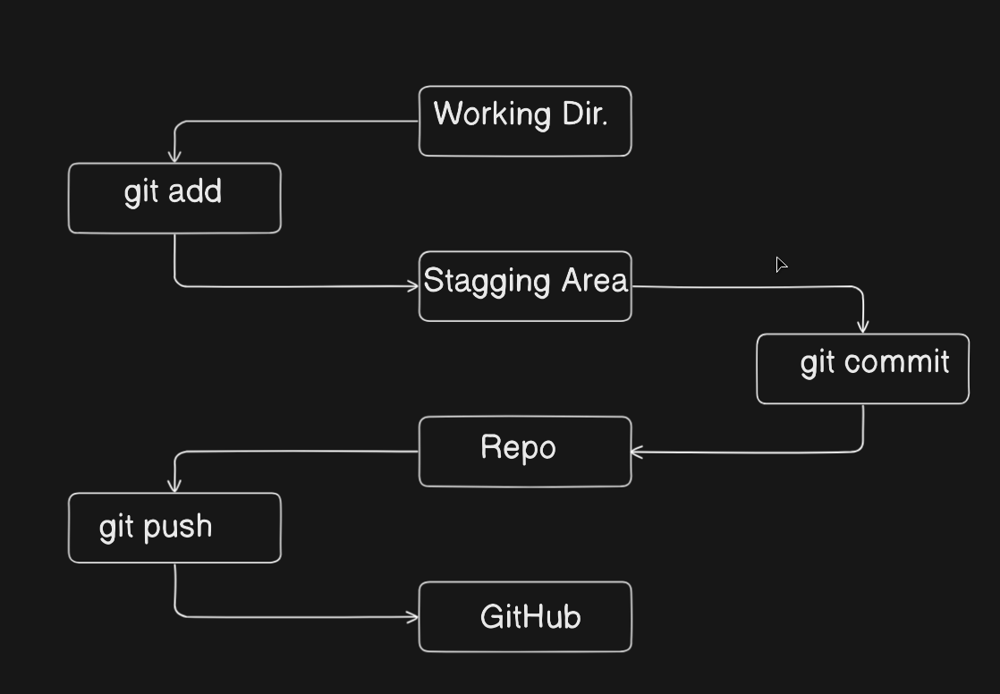
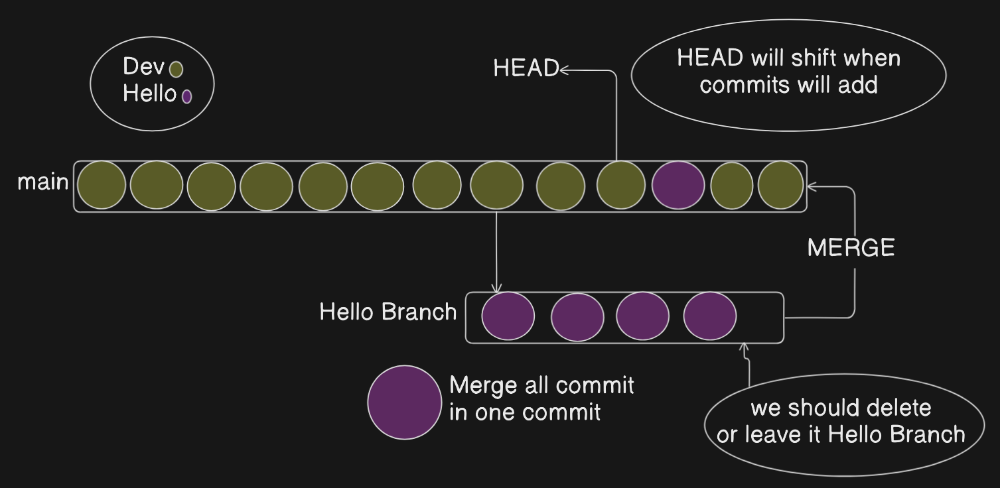

**Git is a distributed version control system that records changes made to files, typically source code, over time . Git is a Software which is used for Version Control System .It tracked files and the changes in files.**

### ←Some terminology that we have to discuss  →

### → R**epository** { Repo }

**A folder which contains a lots of software files .** A **repository** (often called a "repo") in the context of Git and version control systems is a storage space where all the files, folders, and entire history of changes for a project are kept. It includes the project’s current code, previous versions, and metadata about changes such as who made them and when.

### → git version

This returns the current installed Git version

```bash
git --version
```

### → git status

The `git status` command shows the current state of your working directory and the staging area in a Git repository. It lets you see:

- Which files have been modified but are not yet staged for commit.
- Which files are staged and ready to be committed.
- Which files are new and not being tracked by Git.
- The current branch you are on.
- Whether your branch is ahead, behind, or synchronized with the remote branch.

```bash
git status
```

### → git init

The `git init` command is used to **create a new Git repository** in the current directory or a specified directory. Always owns one time per project . it create .`git` folder (hidden folder).

```bash
# Initialize a git repo in the current directory
git init

# Initialize a git repo in a specific folder (creates that folder if not exists)
git init my-project
```

### → git add

After running `git status`, if a file is marked as "modified," it means that the file has been changed in your working directory since the last commit, but those changes are not yet staged or
 committed. In other words, you edited or updated the file, and Git detects it as different from the last saved snapshot, showing its status as "modified." This lets you know which files have unsaved updates so you can decide whether to stage and commit them. So , we have to use `git add`  command . In simple term , It defines that you add something in it .

```bash
git add <filename>       # Stage a specific file
git add .                # Stage all new and modified files in the current directory and subdirectories
git add -A               # Stage all changes in the entire repository (including deletions)
git add <directory>/     # Stage all files inside a specific directory
git add -p               # Interactively choose chunks (hunks) of changes to add
```

### ** Staging Area **

The **staging area** in Git (also called the *index*) is an intermediate space where you prepare changes to be included in your next commit. When you modify files in your working directory, those
 changes are not recorded in Git history until you stage them using `git add`.Staging lets you carefully select and review what goes into the commit, allowing you to craft commits that group related changes logically.

```bash
git init
create files
git add <file1> <file2>
git status
git commit -m""
```



### → git commit

The `git commit` command is used to **save a snapshot of the staged changes** in your local repository, creating a new point in the project history with a unique identifier and a message describing what changed..

- `git commit` only records the files staged with `git add`, not all modified files..
- A **commit** acts like a “save point,” recording the state of the repository at a particular time, along with a descriptive message you provide via `-m "your message"`

```bash
git add file1.txt
git commit -m "Describe your change"
```

### → git diff

The `git diff` command is used in Git to show the differences between various states of your project, allowing you to compare files and see exactly what has changed.

```bash
git diff
git diff --staged
# or equivalently:
git diff --cached
git diff --stat

```

### → git rm

The `git rm` command is used to **remove files or directories from your Git repository** and working directory, and to stage that removal for your next commit…

```bash
git rm <file>
```

### → git log

The `git log` command in Git is used to **display the commit history** of a repository, showing details for each commit such as the author, date, SHA hash, and commit message.                        (overall history)

```bash
git log
git log --oneline 
```

### → git blame

The `git blame` command is used in Git to annotate each line of a file with information about the last commit that modified it.. it defines the history at which time it will be change .

```bash
git blame <file-name>
```

### → git checkout

The **git checkout** command is used in Git to switch between different branches or commits in a repository, updating the working directory to reflect the selected branch or commit.

```bash
git checkout <branch-name>
```

### → git push

The `git push` command is used to upload your local repository content—such as commits and changes—to a remote repository, like one hosted on GitHub. It transfers commits from your local branch to the corresponding branch in the remote repository, making your changes available to others.

```bash
git push origin main # if local branch linked 
git push -u origin main # If your local branch is not linked to a remote branch

```

### *** Revert Back **

  ( Changes in history )

### → git reset

The `git reset` command in Git is a versatile tool used to undo changes by resetting your current branch (HEAD) to a specific commit, and it optionally updates the staging area and working directory depending on the mode you use.

```bash
git reset <file>
git reset --hard <file>
```

### → git revert

The `git revert` command is used to safely undo the changes introduced by a specific previous commit by creating a new commit that reverses those changes

```bash
git log --oneline
git revert 86bb32e

```

### Some important commands :

```bash
cd  # Directory
ls  # Open directory 
mkdir # create directory 
touch  # create file 
pwd   # Print Working Directory
rm filename.txt  # Remove file
rmdir foldername    # Remove folder
cp source.txt destination.txt    # copying a file  
cp -r sourcedir/ destdir/         # copying a directory recursively  
mv oldname.txt newname.txt        # rename a file  
mv file.txt /path/to/folder/      # move file to a folder  
echo "Hello World"                # Print anything in Terminal

```

### ** Branching in Git **

- **Branching in Git** means creating a separate "workspace" or "timeline" where you can work on changes to your project without affecting the main code.
- You can think of a branch as a copy of the project at a certain point where you try new ideas, add features, or fix bugs independently.
- When your work on the branch is done and tested, you merge it back into the main branch to include those changes.

### Lets Understand with Some Diagram

### Figure A


In above image , We see that there is a Branch ( Main ) . in that Branch there is a several commits by two different user { Dev , Hello } . 
We see that the Branch become pollute at the moment and we don’t like the Hello’s changes , So we have to Revert it … But if we revert Hello’s changes or or we used forcefully reset the HEAD . So, we have delete a lots of commits , hard to track the data  and  necessary commit also be deleted……

Necessary means Dev’s commit ..

### Figure B



In Figure A , We got the problem ..
So , here we are having figure B which fix the existing problem 

- Firstly, we have to remove Hello { user }from Main Branch and then invite him to work on …
- Then Hello make a new Branch name  {Hello Branch} and push his change in his Branch .
- After complete the task,  they merge his branch to main branch which is occupied by Dev .
- in that case , Hello having the four commit when  they merge all four commit became a single commit and push in Main Branch .
- After doing all that things , it’s became easy to revert the commits and track it …

```bash
git branch # check which branch you are 
git branch <filename> # create a branch 
git merge origin/branch # for merge the branches 
```

### Figure C


In Figure C,  We see that only one Branch and it is Main Branch …
So, Here is the solution that after pushing the commit we should delete Hello Branch or keep it it doesn’t occur any issue .

### ** Branches Name **

- For adding a features used name like { **git branch “feat/add-chat-support”** }
- For fixing a bug name like { **git branch “login-not-working”** }

```bash
git branch <filename>
git checkout <filename>
          #or
git checkout -b <filename>          
```