**Postman** is a popular API (Application Programming Interface) development and testing tool that simplifies the process of building, testing, documenting, and sharing APIs.

### Definition and History

**Postman** is a comprehensive API development platform used by developers worldwide.

**Key Facts:**

- **Developed by:** Abhinav Asthana, Ankit Sobti, and Abhijit Kane
- **Company:** Postman Inc. (formerly Postdot Technologies)
- **First Release:** 2012 (as a Chrome extension)
- **Standalone App:** 2014
- **Current Status:** Leading API platform with millions of users
- **Headquarters:** San Francisco, California, USA

**Evolution:**

- **2012**: Started as a side project and Chrome browser extension
- **2014**: Released as a standalone desktop application
- **2016**: Introduced Postman Collections for sharing APIs
- **2019**: Raised $50 million in Series B funding
- **2021**: Valued at $5.6 billion after Series D funding
- **Present**: Enterprise-grade API platform

### What is Postman?

Postman is an API client that allows developers to:

- Create and send HTTP requests
- Test API endpoints
- Automate API testing
- Document APIs
- Monitor API performance
- Collaborate with teams
- Mock servers for testing

### API Testing Workflow

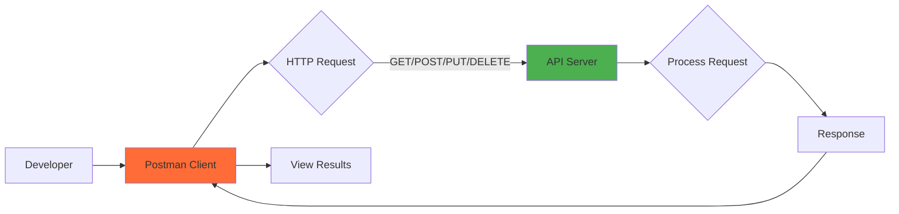

**How it works:**

1. Developer creates a request in Postman
2. Postman sends HTTP request to API server
3. Server processes the request
4. Server sends back response
5. Postman displays the response

### Request-Response Cycle

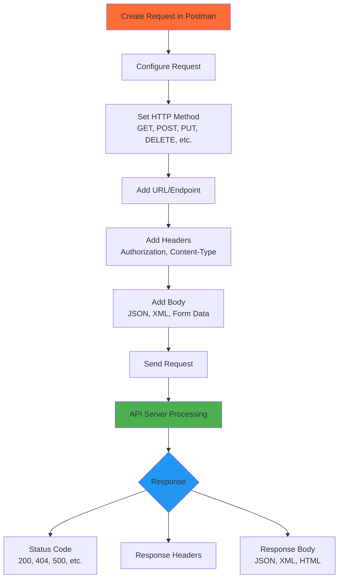

### Key Features

**1. Request Building**

- Support for all HTTP methods (GET, POST, PUT, DELETE, PATCH, etc.)
- Easy parameter management
- Header configuration
- Body formats (JSON, XML, form-data, raw, binary)

**2. Collections**

- Organize related requests
- Share with team members
- Version control
- Import/Export functionality

**3. Environment Variables**

- Manage different environments (dev, staging, production)
- Store API keys and tokens securely
- Reuse values across requests

**4. Testing & Automation**

- Write test scripts in JavaScript
- Automated testing
- Continuous Integration (CI/CD) integration
- Collection Runner for batch testing

**5. Documentation**

- Auto-generate API documentation
- Interactive documentation
- Share with team or public

**6. Mock Servers**

- Create mock APIs
- Test without actual backend
- Simulate different scenarios

**7. Monitoring**

- Schedule API tests
- Monitor API performance
- Get alerts for failures

### Postman Architecture

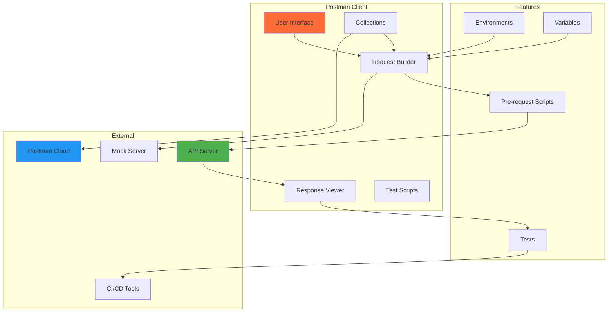

### HTTP Methods Supported

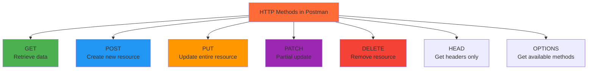

### Request Components

**URL Structure:**

```
https://api.example.com/v1/users?page=1&limit=10
└────┬────┘└─────┬──────┘└┬┘└─┬─┘└────┬──────────┘
  Protocol    Base URL   Ver Path  Query Params
```

**Request Parts:**

1. **Method**: GET, POST, PUT, DELETE, etc.
2. **URL**: API endpoint address
3. **Headers**: Metadata (Content-Type, Authorization)
4. **Body**: Data to send (for POST, PUT, PATCH)
5. **Query Parameters**: URL parameters (?key=value)
6. **Path Variables**: Dynamic URL segments

### Example: API Request Flow

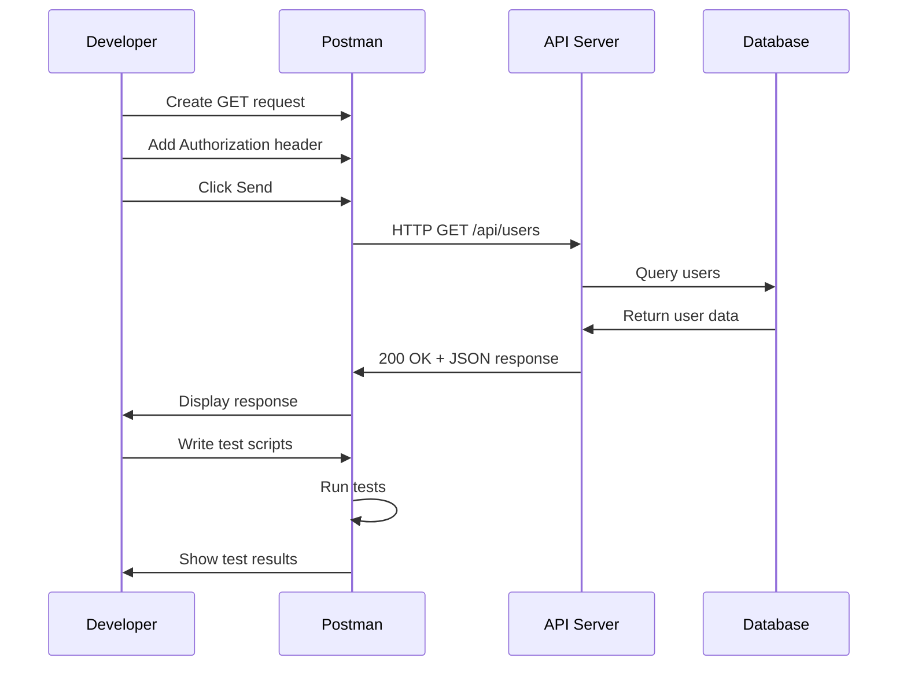

### Collections Example

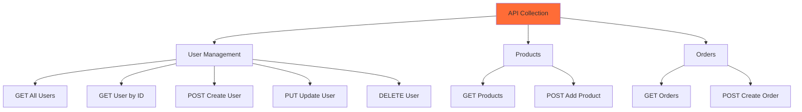

### Environment Variables

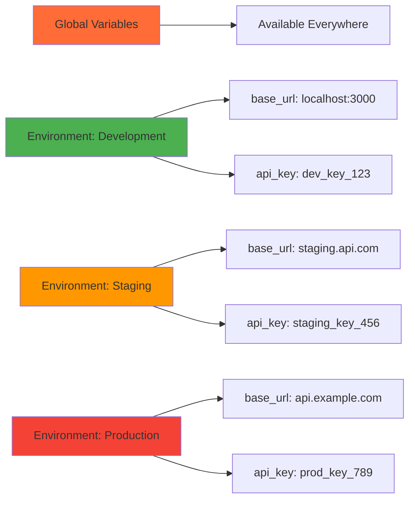

**Usage:**

```jsx
// In URL
base_url/api/users

// In Headers
Authorization: Bearer api_key

// In Scripts
pm.environment.get("base_url")
```

### Testing with Postman

**Test Script Example:**

```jsx
// Test status code
pm.test("Status code is 200", function () {
    pm.response.to.have.status(200);
});

// Test response time
pm.test("Response time is less than 500ms", function () {
    pm.expect(pm.response.responseTime).to.be.below(500);
});

// Test response body
pm.test("Response has user data", function () {
    var jsonData = pm.response.json();
    pm.expect(jsonData.name).to.exist;
    pm.expect(jsonData.email).to.include("@");
});

// Save data to environment
pm.test("Save user ID", function () {
    var jsonData = pm.response.json();
    pm.environment.set("user_id", jsonData.id);
});
```

### Test Workflow

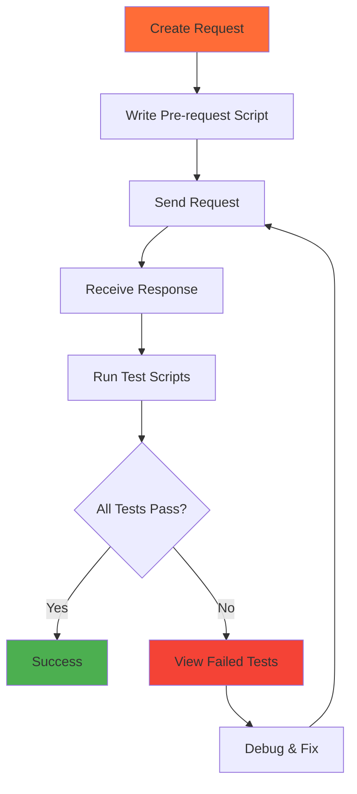

### Response Components

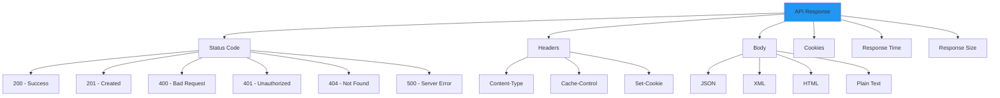

### Common Use Cases

**1. API Development**

- Design and prototype APIs
- Test endpoints during development
- Debug API issues

**2. API Testing**

- Functional testing
- Integration testing
- Regression testing
- Load testing (with Newman)

**3. API Documentation**

- Create interactive docs
- Share with team
- Publish for external developers

**4. Team Collaboration**

- Share collections
- Sync across team
- Version control

**5. Automation**

- CI/CD integration
- Scheduled monitoring
- Automated testing pipelines

### Postman vs Newman

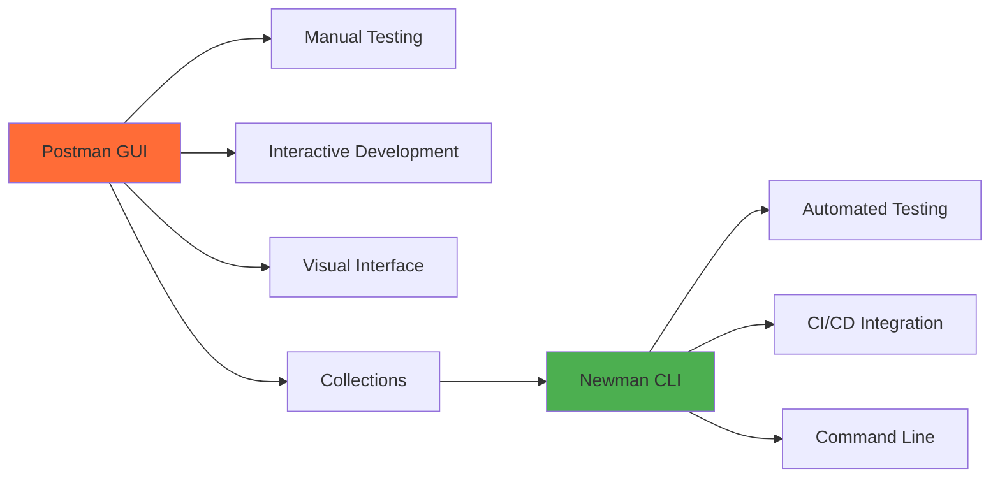

**Newman** is the command-line companion for Postman that allows you to run collections directly from the command line.

**Newman Usage:**

```bash
# Install Newman
npm install -g newman

# Run collection
newman run collection.json

# Run with environment
newman run collection.json -e environment.json

# Generate HTML report
newman run collection.json -r html
```

### Integration with CI/CD

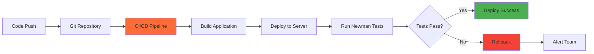

### Authentication Methods

Postman supports various authentication types:

**1. API Key**

```
X-API-Key: your_api_key_here
```

**2. Bearer Token**

```
Authorization: Bearer your_token_here
```

**3. Basic Auth**

```
Authorization: Basic base64(username:password)
```

**4. OAuth 2.0**

- Authorization Code
- Client Credentials
- Implicit Flow
- Password Grant

**5. Digest Auth**

**6. AWS Signature**

**7. NTLM Authentication**

### Mock Server Flow

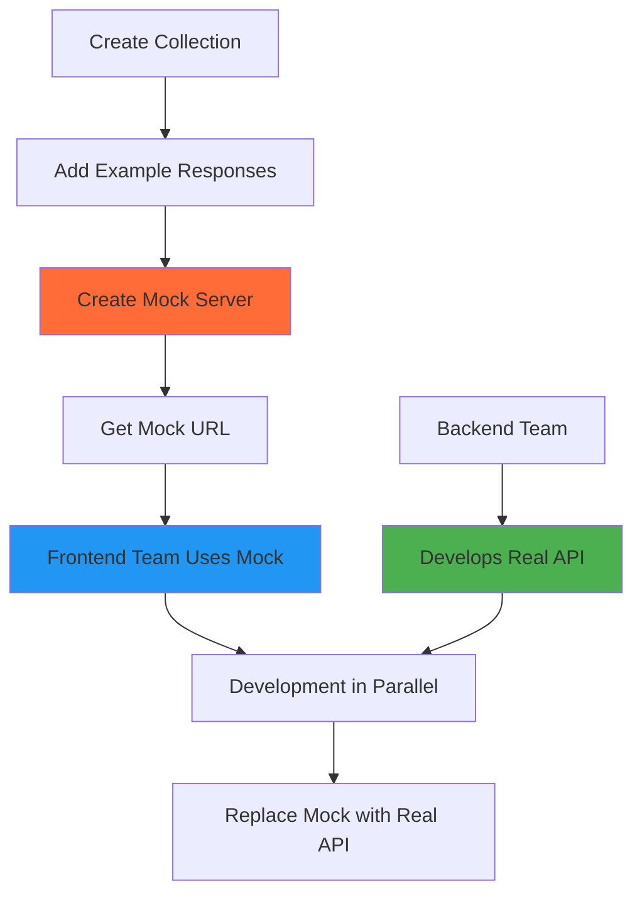

### Postman Workspace Types

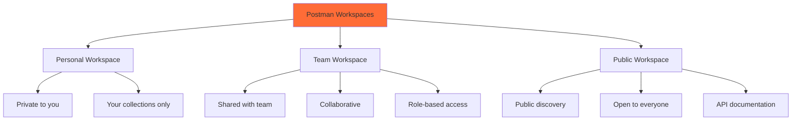

### Best Practices

**Organization:**

- Use collections to group related requests
- Name requests descriptively
- Add descriptions and documentation
- Use folders for better organization

**Variables:**

- Use environment variables for different environments
- Store sensitive data as variables
- Use global variables for common values
- Never hardcode credentials

**Testing:**

- Write tests for all requests
- Test status codes
- Validate response structure
- Check response times
- Use meaningful test names

**Collaboration:**

- Share collections with team
- Use version control
- Document your APIs
- Use consistent naming conventions

**Security:**

- Don't commit API keys to version control
- Use environment variables for secrets
- Enable two-factor authentication
- Use Postman Vault for sensitive data

### Common Response Status Codes

| Status Code | Meaning | Description |
| --- | --- | --- |
| **2xx - Success** | | |
| 200 | OK | Request succeeded |
| 201 | Created | Resource created successfully |
| 204 | No Content | Success but no content to return |
| **3xx - Redirection** | | |
| 301 | Moved Permanently | Resource moved to new URL |
| 304 | Not Modified | Cached version is still valid |
| **4xx - Client Errors** | | |
| 400 | Bad Request | Invalid request syntax |
| 401 | Unauthorized | Authentication required |
| 403 | Forbidden | No permission to access |
| 404 | Not Found | Resource doesn't exist |
| 429 | Too Many Requests | Rate limit exceeded |
| **5xx - Server Errors** | | |
| 500 | Internal Server Error | Server encountered an error |
| 502 | Bad Gateway | Invalid response from upstream |
| 503 | Service Unavailable | Server temporarily unavailable |

### Postman Alternatives

While Postman is the most popular, other tools include:

- **Insomnia** - Open-source REST client
- **Thunder Client** - VS Code extension
- **Paw** - macOS native API tool
- **curl** - Command-line tool
- **HTTPie** - User-friendly CLI
- **REST Client** - VS Code extension
- **Swagger UI** - API documentation and testing

### Why Use Postman?

**Advantages:**

- User-friendly interface
- Comprehensive feature set
- Cross-platform support (Windows, macOS, Linux)
- Team collaboration features
- Extensive documentation
- Large community support
- Free tier available
- CI/CD integration
- Mock servers
- API monitoring

**Use Cases:**

- Backend API development
- Frontend-backend integration
- API testing and debugging
- API documentation
- Team collaboration
- Automated testing
- Performance monitoring

### Getting Started

**Installation:**

1. Visit [postman.com](https://postman.com)
2. Download for your operating system
3. Install and create account
4. Create your first workspace
5. Start building requests

**First Request:**

1. Click "New" -> "HTTP Request"
2. Enter URL: https://jsonplaceholder.typicode.com/users
3. Select method: GET
4. Click "Send"
5. View response in the response panel
